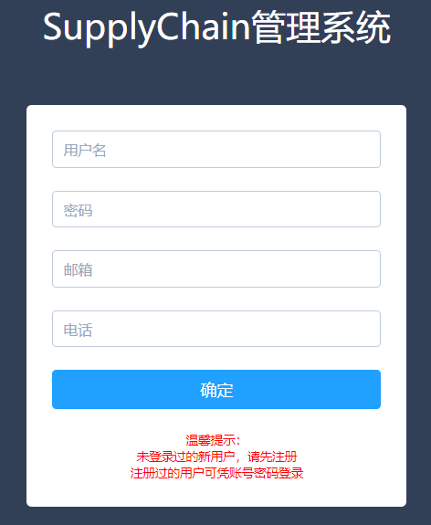
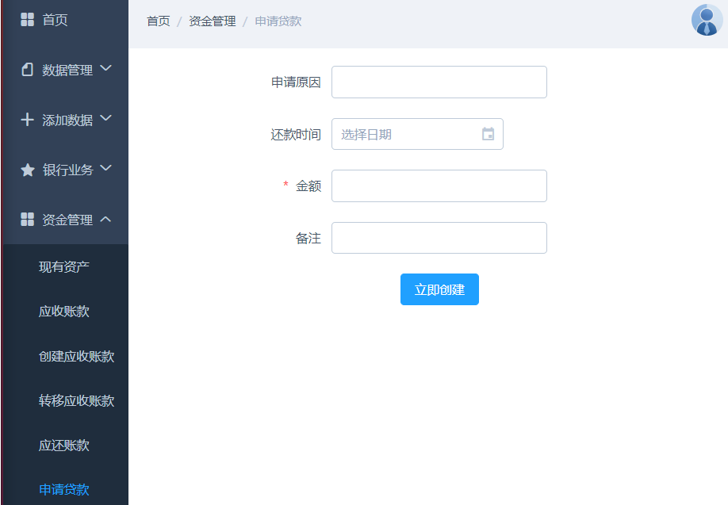
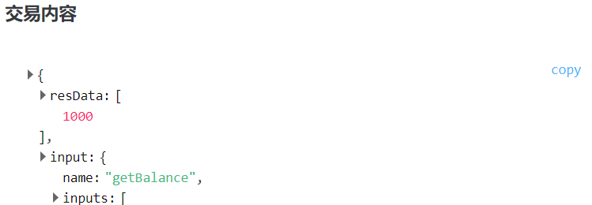
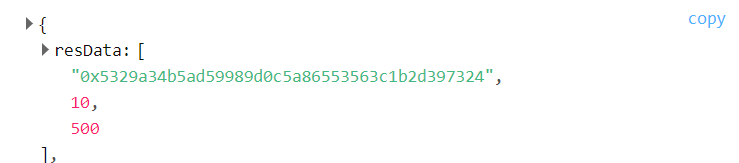

# 基于区块链的供应链金融平台 

| 年级     | 2017        | 专业（方向） | 软件工程          |
| -------- | ----------- | ------------ | ----------------- |
| 学号     | 17343008    | 姓名         | 陈灿辉            |
| 电话     | 13580900798 | Email        | 1178160567@qq.com |
| 开始日期 | 2019-11-15  | 完成日期     | 2019-12-13        |

[TOC]

## 作业内容

项目设计说明：根据提供的供应链场景，基于FISCO-BCOS设计相关的智能合约并详细解释智能合约是如何解决提出的问题。

功能测试文档：将智能合约部署至链上（单节点or多节点），并调用相关函数，详细说明上述的四个功能具体是如何实现的。（截图说明调用结果）

## 项目背景


### 传统供应链金融

某车企（宝马）因为其造车技术特别牛，消费者口碑好，所以其在同行业中占据绝对优势地位。因此，在金融机构（银行）对该车企的信用评级将很高，认为他有很大的风险承担的能力。在某次交易中，该车企从轮胎公司购买了一批轮胎，但由于资金暂时短缺向轮胎公司签订了1000万的应收账款单据，承诺1年后归还轮胎公司1000万。这个过程可以拉上金融机构例如银行来对这笔交易作见证，确认这笔交易的真实性。在接下里的几个月里，轮胎公司因为资金短缺需要融资，这个时候它可以凭借跟某车企签订的应收账款单据向金融结构借款，金融机构认可该车企（核心企业）的还款能力，因此愿意借款给轮胎公司。但是，这样的信任关系并不会往下游传递。在某个交易中，轮胎公司从轮毂公司购买了一批轮毂，但由于租金暂时短缺向轮胎公司签订了500万的应收账款单据，承诺1年后归还轮胎公司500万。当轮毂公司想利用这个应收账款单据向金融机构借款融资的时候，金融机构因为不认可轮胎公司的还款能力，需要对轮胎公司进行详细的信用分析以评估其还款能力同时验证应收账款单据的真实性，才能决定是否借款给轮毂公司。这个过程将增加很多经济成本，而这个问题主要是由于该车企的信用无法在整个供应链中传递以及交易信息不透明化所导致的。

### 区块链+供应链金融

将供应链上的每一笔交易和应收账款单据上链，同时引入第三方可信机构来确认这些信息的交易，例如银行，物流公司等，确保交易和单据的真实性。同时，支持应收账款的转让，融资，清算等，让核心企业的信用可以传递到供应链的下游企业，减小中小企业的融资难度。

### 实现功能

功能一：实现采购商品一签发应收账款交易上链。例如车企从轮胎公司购买一批轮胎并签订应收账款单据。

功能二：实现应收账款的转让上链，轮胎公司从轮毂公司购买一笔轮毂，便将于车企的应收账款单据部分转让给轮毂公司。轮毂公司可以利用这个新的单据去融资或者要求车企到期时归还钱款。

功能三：利用应收账款向银行融资上链，供应链上所有可以利用应收账款单据向银行申请融资。

功能四：应收账款支付结算上链，应收账款单据到期时核心企业向下游企业支付相应的欠款。

## 方案设计

### 设计思想

供应链金融的核心是如何处理应付款账单，对此我采用了现在区块链上比较流行的代币的形式，即把企业的应收账单当成是一个企业发行，银行监管的token。企业和银行要对token进行负责，并且认可token的价值。也就是银行在给企业确定应收账款额度的时候需要附上银行的签名，而核心企业向下游企业发放应收账款的时候也需要加上自己的数字签名。有了这两层的数字签名后，银行和企业都要对应收账款负责，下游企业也可有随时认证应收账款的真实性。同时为了防止企业无限量或过度发行应收账单，银行需要对核心企业进行评估，即银行可以对核心企业进行资产评定，或入池质押。同时应收账单可以类似token一样流通在网络中，产生交易等。此外，我还设计了电子钱包的概念（类似于网上银行）可以直接跟现实世界中的金钱交互。此外为了维护链上应收账款的真实有效性，跟踪应收账款的流向，防止企业超额发放应收账款，企业或银行可以定期向链上发布调研，使用同态加密技术，收集应收账款的信息，同时也维护了企业的内部财务隐私安全。详细的设计细节参见下面的报告。

### 数据流图

供应链交易流程，这里将供应链上的参与者抽象化成4种角色：银行、核心企业、中游企业、下游企业，他们之间的关系和交互图如下所示


数据流图


### 存储结构

**公司信息**

这里我设置的公司信息比较简单，报告公司在链上的账户地址，公司的ID，以及公司名。同时我还做了限制，就是一个账号只能创建一个公司，每一个公司的公司名必须唯一。

```javascript
    struct Company{
        address companyAddr;
        uint companyID;
        string name;
    }
```

**发票信息**

每一笔的交易都应该记录在发票上面，发票的信息包括其相对应的编号，收/付款方的地址，交易的金额，并且自动写入当前发票成了的时间戳，允许在发票上进行相关的备注

```javascript
    //发票，完成相对应的采购记录后就上链保存
    struct Invoice{
        uint invoiceID; //发票号
        address payeeAddr; //收款方
        address payerAddr; //付款方
        uint amount; //金额
        uint timestamp; //建立的时间戳
        string remark; //相关备注
    }
```

**应收账单**

核心企业可以通过银行的认证后给下游的企业发行应收账单，应收账单包括付款者的地址，应该归还的时间，以及这笔账单应该归还的本金数

```javascript
    //应收账单
    struct PaymentSchedule {
        address payerAddr; //付款者地址
        uint dueTime; //应还时间，越短越具有即时性,这里我特殊设置0为表示该公司的信用程度，即金融机构最多相信该核心企业的还款能力，对应到就类似于金融机构给核心企业发的token
        uint amount; //应还本金,逐步减少，直到为0的时候就可以删除了
        uint distributeAmount; //银行给企业的额度
        uint originalAmount; //核心企业发放给下游企业时的金额
        uint timestamp; //核心企业发放给下游企业时签发时的时间戳，防止重放攻击
        string bankSignature; // payerAddr + distributeAmount
        string companySignature; //payerAddr + dueTime + originalAmount + timestamp
    }
```

**还款请求**

下游企业可以向发放应收账款的核心企业提出还款申请，该申请将会上链，并被对应的核心企业查看到。

```javascript
        //请求还款
    struct PaymentRequest{
        address owner;
        uint paymentID;
        address payerAddr; //付款者地址
        uint dueTime; //应还时间，越短越具有即时性,这里我特殊设置0为表示该公司的信用程度，即金融机构最多相信该核心企业的还款能力，对应到就类似于金融机构给核心企业发的token
        uint amount; //应还本金,逐步减少，直到为0的时候就可以删除了
    }
```

**贷款信息**

贷款信息包括贷款人的账号地址，应该归还的本金，应该归还的利息，以及已经归还的金额

```javascript
    struct LoanInfo{
        address claimerAddr;
        uint principleAmount; //应还本金
        uint interestAmount;  //应还利息
        uint paidAmount; //已还金额
    }
```

**贷款申请**

企业可以想银行发出贷款申请，该申请信息将会上链，并且被银行查看并处理。

```javascript
    struct LoanRequest{
        address claimerAddr;
        uint amount;
    }
```

**电子钱包**

这部分是可选的实现，即核心企业可以跟银行合作，使用银行的电子钱包，如网上银行等，与银行的账号自动关联，可以在支付应付款单的时候自动从电子钱包中扣费

```javascript
    //电子钱包-类似网上银行，与银行账号等相关联，直接由银行控制
    mapping (address => uint) moneyBalances;
```

**入池质押**

 企业向银行申请贷款的时候可以入池质押，同时核心企业特可以在银行注册一定的财产还获得应收账款的额度。

```javascript
contract AssetManagement is Ownable{
    
    struct Asset{
        string assetName;
        address owner;
        uint value;
    }
    
    Asset[] assets;
    
    function registerAsset(string assetName, address owner, uint value) public onlyOwner{
        assets.push(Asset(assetName, owner, value));
    }
    
    function getAssetsNumber() public view returns(uint){
        return assets.length;
    }
    
    function getAsset(uint index) public view returns(string assetName, address owner, uint value){
        uint len = assets.length;
        require(index >= 0 && index < len, "out of range");
        return (assets[index].assetName, assets[index].owner, assets[index].value);
    }
    
    function unregisterAsset(string assetName, address owner) public onlyOwner{
        for (uint i = 0; i < assets.length; i++){
            if (equalTo(assets[i].assetName, assetName) && assets[i].owner == owner){
                deleteAsset(i);
            }
        }
    }
    
    function deleteAsset(uint index) internal{
        uint len = assets.length;
        require(index >= 0 && index < len, "out of range");
        assets[index] = assets[len - 1];
        assets.length -= 1;
    }
    
    function equalTo(string _a, string _b) private pure returns (bool){
        return keccak256(_a) == keccak256(_b);
    }
}
```

**公钥管理系统**

这里主要是允许用户公布自己的公钥，公钥包括签名的公钥，也就是区块链上账号对应的公钥。还有一个就是进行同态加密是使用的paillier公钥，对应私钥需要用户自己在本地好好保存。

```javascript
contract PublicKeyManagement is Ownable{
    
    mapping(address => string) signaturePublicKey;
    
    mapping(address => string) paillierPublicKey;
    
    function registerSignaturePublicKey(address addr, string key) public self_OR_Owner(addr){
        // require(msg.sender == addr || msg.sender == currentOwner);
        signaturePublicKey[addr] = key;    
    }
    
    function registerPaillierPublicKey(address addr, string key) public self_OR_Owner(addr){
        paillierPublicKey[addr] = key;
    }
    
    function getSignaturePublicKey(address addr) public view returns(string){
        return signaturePublicKey[addr];
    }
    
    function getPaillierPublicKey(address addr) public view returns (string){
        return paillierPublicKey[addr];
    }
}
```

**同态加密调查**

这里允许企业或者银行以同态加密的方式在链上部署上调研，同时由于同态加密的特点，可以很好的保护链上用户的隐私

```javascript
contract CipherInformation{
        //账单调查
    struct BalanceSurvey{
        string ciphertext;
        string paillierPublicKey;
    }
    
    BalanceSurvey[] balanceSurveys;
    
    function createBalanceSurvey(string ciphertext, string paillierPublicKey) public returns(uint index){
        balanceSurveys.push(BalanceSurvey(ciphertext, paillierPublicKey));
        return balanceSurveys.length - 1;
    }
    
    function getBalanceSurvey(uint index) public returns(string ciphertext, string paillierPublicKey){
        uint len = balanceSurveys.length;
        require(index >=0 && index < len, "out of range");
        return (balanceSurveys[index].ciphertext, balanceSurveys[index].paillierPublicKey);
    }
    
    function updateBalance(uint index, string ciphertext) public{
        balanceSurveys[index].ciphertext = ciphertext;
    } 
}
```


## 运行环境

借助Fisco-bcos的WeBase进行开发

Fisco-bcos运行环境：Ubuntu 18.04.3

前端开发环境：Windows 10

区块链框架：Fisco-bcos + Webase

前端框架：Vue + element-ui

服务端框架：node + Express

密码学技术：基于`eth-crypto` 的数字签名，基于`paillier`算法的同态加密

运行步骤：

1. 先在Ubuntu 系统中启动FiscoBcos服务，并且启动WeBase服务，详情请参考https://webasedoc.readthedocs.io/zh_CN/latest/docs/WeBASE-Console-Suit/index.html

2. 若是使用虚拟机跑Fisco-Bcos环境，使用Windows进行开发，请先设置虚拟机网络连接为桥接模式，并且查看Fisco-BCOS的IP地址，以及WeBase运行的前端端口。然后在/Server/文件夹下找到fisco_bcos_api.js文件，修改器文件的相关配置信息，IP地址，端口等

   ```javascript
   var ipAddress = "172.19.60.62";
   var port = 7002;
   ```

3. 将contracts/文件夹下的合约文件通过Webase部署到Fisco-bcos链上，部署合约应该包括如下内容

   

4. 在web的文件夹下，先运行如下命令，来安装相对应的包依赖

   ```
   npm install
   ```

   安装好依赖后需要开启两个终端，在其中一个终端输入以下命令

   ```bash
   node ./app.js
   ```

   来启动服务端，同时在另外一个终端上输入

   ```
   npm run dev
   ```

   来启动前端，启动完毕会访问http://localhost:8080/#/ 即可进入页面。注意到3000端口和8080端口不应该被占用，如被占用，请情调相对应的进程或者修改相对应的端口。

## 实现功能

这部分我将介绍我的项目的实现功能，以及其对应的前端、后端、链端的核心代码，详细代码请参考代码所在文件。

### 后端与链端交互

这里我后端使用nodejs实现，后端框架为express，后端与链的交互是通过Webase提供的接口实现，详情请参考官方文档https://webasedoc.readthedocs.io/zh_CN/latest/docs/WeBASE-Front/interface.html

首先根据接口规范，我们跟链端进行交互主要使用http的get post方法，为了方便后续操作，这里我将总的操作放在`fisco_bcos_api.js` 文件中，并且抽象出两个基本函数，来实现get post请求

get请求如下所示

```javascript
//http get for webase api
exports.httpGet = function (path, callback){
    var req = http.get({
        hostname:ipAddress,
        port:port,
        path: path,
    }, function(response){
        var dataStr = "";
        response.on("data", (data) => {
            dataStr += data.toString();
            // var parsedData = JSON.parse(data.toString());
            // callback(parsedData);
        });
        response.on("end", (data) => {
            var parsedData = JSON.parse(dataStr);
            callback(parsedData);
        }) 
    });
    req.on("error", function(error){
        console.log("problem with get request:", error.message); 
    });
    req.end();
}

var httpGet = exports.httpGet;
```

而post请求如下所示

```javascript
//http post for webase api
exports.httpPost = function (path, jsonData, callback){
    var contents = jsonData;
    var options = {
        hostname:ipAddress,
        port:port,
        path:path, 
        method:"POST",
        headers: {
            'Content-Type':'application/json',
            // 'Content-Length':contents.length
        }
    };

    var req = http.request(options, function(res){
        res.setEncoding("utf-8");
        var dataStr = "";
        res.on("data", function(data){
            dataStr += data.toString();
        });
        res.on("end", (data) => {
            var parsedData = JSON.parse(dataStr);
            callback(parsedData);
        });
    });
    req.on("error", function(error){
        console.log("problem with post request:", error.message);
    });
    req.write(contents);
    req.end();
};

var httpPost = exports.httpPost;
```

**获取本地秘钥**

在后端中，通过前面的get请求，我们可以获得到链端本地的地址等信息

```javascript
exports.getLocalKeyStores = function(callback){
    httpGet("/WeBASE-Front/privateKey/localKeyStores", callback);
};
```

**合约调用**

这部分是整一个的核心，前后端和链端的主要交互就是通过合约调用来完成，根据文档中的接口，我们可以设计后端进行合约调用的接口如下

```javascript
//交易处理，合约函数调用
exports.transationHandle = function(userAddress, contractName, contractAddress, funcName, funcParam, callback){
    var path = "/WeBASE-Front/trans/handle";
    var contents = JSON.stringify({
        "useAes":false,
        "user":userAddress,
        "contractName": contractName,
        "contractAddress": contractAddress,
        "funcName": funcName,
        "funcParam": funcParam,
        "groupId": "1",
    });
    httpPost(path, contents, callback);
};
```

**获取合约列表**

由于合约可能更新，写死合约地址肯定不合适，这里我们在进入系统的时候就先获得合约的地址，方便后面进行合约调用的时候将地址和合约名对应上。根据接口获得合约列表及其合约名，地址等信息的函数如下所示

```javascript
exports.getContractList = function(callback){
    var path = "/WeBASE-Front/contract/contractList";
    var contents = JSON.stringify({
        "groupId": "1",
        "pageNumber": 0,
        "pageSize": 10,
        "contractName": "",
        "contractAddress": "",
        "contractStatus": 2
    });
    httpPost(path, contents, callback);
};

exports.getContractList(function(data){
    // console.log(data);
     
    exports.contractInfo = [];
    for (var i = 0; i < data.data.length; i++){
        exports.contractInfo.push({
            contractName:data.data[i].contractName, 
            contractAddress:data.data[i].contractAddress
        });
    }
});

exports.getContractAddressByName = function(contractName){
    for (var i = 0; i < exports.contractInfo.length; i++){
        if (contractName == exports.contractInfo[i].contractName){
            return exports.contractInfo[i].contractAddress;
        }
    }
    return null;
};
```

### 前端与后端交互

我这里使用的是vue来实现前端，因此前端页面跳转如下所示


### 账号管理

这里主要是本地的登录注册问题。虽然区块链上面的账号主要是通过address和私钥来作为账号的，但是这样并不用户友好，因为在本地登录的时候如果只用记住自己的账号密码就好了。而账号对应的address等则是由后端完成的。

**后端**

这里账号信息是存储在链上的，而在本地后端中，我们只要存储相对应的用户名和密码等信息就好了，因为可以在链上查找到更加信息的信息，本地后端存储内容如下，可以根据需求修改

```json
{
    "users": [
        {
            "username": "test",
            "password": "123456",
            "email": "",
            "phone": ""
        },
        {
            "username": "MotorCompany",
            "password": "123456",
            "email": "MotorCompany@sysu.edu.cn",
            "phone": "12345678"
        },
        {
            "username": "TireCompany",
            "password": "123456",
            "email": "TireCompany@sysu.edu.cn",
            "phone": "12345678"
        },
        {
            "username": "HubCompany",
            "password": "123456",
            "email": "HubCompany@sysu.edu.cn",
            "phone": "12345678"
        },
        {
            "username": "Bank",
            "password": "123456",
            "email": "Bank@sysu.edu.cn",
            "phone": "12345678"
        }
    ]
}
```

**后端与链端交互**

首先登陆后我们需要记录下当前登陆的用户的地址信息，以便在后面进行交互等，这就需要通过后端跟链端进行交互

```javascript
//设置当前用户的地址
exports.setCurrentAddressByUsername = function(userName, callback){
    exports.getLocalKeyStores(function(users){
        // console.log(users);
        for (var i = 0; i < users.length; i++){
            if (userName == users[i].userName){
                // console.log(users[i].address);
                exports.currentAddress = users[i].address;
                exports.currentPublicKey = users[i].publicKey;
                exports.currentPrivateKey = users[i].privateKey;
                callback();
                return ;
            }
        }
        console.log("could not find the user's address");
        // console.log();
        callback();
    });
};
```

此外在注册的时候我们需要创建出一个新的账号地址信息

```javascript
//获取新的私钥
exports.newAddress = function(userName, callback){
    var path = "/WeBASE-Front/privateKey?useAes=false&type=0&userName=" + userName;
    httpGet(path, callback);
};
```

**前端**



这部分的页面显示我使用vue写了一个组件来完成，参见pages文件夹下的`login.vue` 文件，使用vue实现单页Web应用（single page web application，*SPA*）

```html
<template>
	
  	<div class="login_page fillcontain">
		  <!-- <el-button>hi</el-button> -->
	  	<transition name="form-fade" mode="in-out">
	  		<section class="form_contianer" v-show="showLogin">
		  		<div class="manage_tip">
		  			<p>SupplyChain管理系统</p>
		  		</div>
		    	<el-form :model="loginForm" :rules="rules" ref="loginForm">
					<el-form-item prop="username">
						<el-input v-model="loginForm.username" placeholder="用户名"><span>dsfsf</span></el-input>
					</el-form-item>
					<el-form-item prop="password">
						<el-input type="password" placeholder="密码" v-model="loginForm.password"></el-input>
					</el-form-item>
					<el-form-item prop="email" v-show="isRegister">
						<el-input v-model="loginForm.email" placeholder="邮箱"><span>dsfsf</span></el-input>
					</el-form-item>
					<el-form-item prop="phone" v-show="isRegister">
						<el-input v-model="loginForm.phone" placeholder="电话"><span>dsfsf</span></el-input>
					</el-form-item>
					<el-form-item v-show="isLogin">
				    	<el-button type="primary" @click="signin" class="submit_btn">登陆</el-button>
				  	</el-form-item>
					<el-form-item v-show="isLogin">
				    	<el-button type="primary" @click="turn" class="submit_btn">注册</el-button>
				  	</el-form-item>
					<el-form-item v-show="isRegister">
				    	<el-button type="primary" @click="signup" class="submit_btn">确定</el-button>
				  	</el-form-item>
				</el-form>
				<p class="tip">温馨提示：</p>
				<p class="tip">未登录过的新用户，请先注册</p>
				<p class="tip">注册过的用户可凭账号密码登录</p>
	  		</section>
	  	</transition>
  	</div>
</template>
```

登陆是涉及到的相关函数如下，主要是和后端进行交互，验证账号信息

```javascript
signin: function(){
    this.isLogin = true;
    this.isRegister = false;
    var obj = {
        username:this.loginForm.username,
        password:this.loginForm.password
    };
    console.log(obj);
    var _this = this;
    this.$http.post("/admin/signin", {
        userInfo: obj
    }).then(response => {
        this.$message({message:"登录成功", type:"success"});
        this.$router.push("manage");
    }, response => {
        this.$message.error("用户名或密码不正确")
    });
},
    turn: function(){
        this.isRegister = true;
        this.isLogin = false;
    },
        signup: function(){
            //检查有没有问题
            var obj = {
                username:this.loginForm.username,
                password:this.loginForm.password,
                email:this.loginForm.email,
                phone:this.loginForm.phone
            };
            this.$http.post("/admin/register", {
                userInfo:obj
            }).then(response => {
                this.isLogin = true;
                this.isRegister = false;
            }, response => {
                this.$message.error("注册失败");
            });
        },
            test:function(){
                this.$http.get("/test").then(response => {
                    console.log(response.body);
                });
            }
```

### 权限控制

权限控制主要是通过solidity的require语句实现的读写访问控制

**链端**

在这里会涉及到权限的问题，如如果给企业评定登记，贷款业务的处理等，这里都只能由权威的金融机构--银行来进行处理。故我这里先设置了一个抽闲合约，来实现基本的权限管理，这里的权限我简单的设置为owner权限。默认是新建合约的人就是owner，考虑到可能一开始部署合约的是第三方，故在合约中加入了权限转移的函数，使得最终链上的相关认证权利落银行手中，详情请参见`ownable.sol` 文件

```javascript
pragma solidity ^0.4.24;

// 基础的权限控制
contract Ownable {
    address private currentOwner;

    event TransferOwnership(address indexed oldOwner, address indexed newOwner);

    // internal只能被继承
    constructor () internal {
        currentOwner = msg.sender;
        emit TransferOwnership(address(0), currentOwner);
    }

    //当前的owner
    function owner() public view returns (address) {
        return currentOwner;
    }

    // a function modifier 'onlyOwner' 添加权限
    modifier onlyOwner() {
        require(msg.sender == currentOwner);
        _;
    }
    
    //管理员或者自己才有权限
    modifier self_OR_Owner(address addr){
        require(msg.sender == currentOwner || msg.sender == addr);
        _;
    }


    // 所有权转移，所有权主要是在银行等金融机构中
    function transferOwnership(address newOwner) public onlyOwner {
        require(newOwner != address(0));
        emit TransferOwnership(currentOwner, newOwner);
        currentOwner = newOwner;
    }
}

```

### 公司注册

**链端**

在SupplyChain.sol文件中，我添加了公司注册等功能，这里公司的相关信息如下所示

```javascript
    struct Company{
        address companyAddr;
        uint companyID;
        string name;
    }

    uint companyNum;
    mapping (uint => Company) companies;
```

每一个账户只允许创建一个公司，并且公司名不能相同

```javascript
    //注册公司
    function registerCompany(string companyName) public returns(uint) {
        address companyAddr = msg.sender;
        for (uint i = 1; i <= companyNum; i++){
            require(!equalTo(companyName, companies[i].name), "Company name already exists");
            require(companyAddr != companies[i].companyAddr, "Company address already exists");
        }
        uint companyID = ++companyNum;
        companies[companyID] = Company(companyAddr, companyID, companyName);
        // emit CompanyID(companyID, name);
        return companyID;
    }
```

允许在外部查看当前公司的相关信息，获得连上参加的公司的数量等

```javascript
    function getCompany(uint id) public view returns (address companyAddr, uint companyID, string name){
        require(id > 0 && id <= companyNum);
        return (companies[id].companyAddr, companies[id].companyID, companies[id].name);        
    }

    function getCompanyNum() public view returns (uint){
        return companyNum;
    }
```

**后端**

express路由设置，公司注册主要是前端页面向后端服务器发出请求

```javascript
registerCompany:function(){
    var obj = {
        companyName: this.formData.name
    };
    this.$http.post("/data/registerCompany", {
        companyInfo : obj
    }).then(response => {
        this.$message({message:"注册成功", type:"success"});
        // this.$router.push("manage");
    }, response => {
        this.$message.error("注册失败")
    });
}
```

路由器接受到相对应的post请求后调用后端与链端交互的函数

```javascript
router.post("/data/registerCompany", function(req, res){
	var companyName = req.body.companyInfo.companyName;
	SupplyChain.registerCompany(companyName, function(data){
		if (data.statusOK){
			res.send();
		}else {
			res.status(500).send();
		}
	});
});
```

调用合约函数的代码如下所示

```javascript
exports.registerCompany = function(companyName, callback){
    // console.log(FiscoBcos.currentAddress);
    contractAddress = FiscoBcos.getContractAddressByName("SupplyChain");
    // console.log(contractAddress);
    FiscoBcos.transationHandle(FiscoBcos.currentAddress, contractName, contractAddress, "registerCompany", [companyName], callback);
};
```

 后端调用链端的合约函数，来获得链上的所有公司信息

```javascript
exports.getAllCompanies = function(callback){
    exports.getCompanyNum(function(num){
        var companies = [];
        for (var i = 0; i < num; i++){
            exports.getCompany(i, function(company){
                company = exports.arrayToCompanyStruct(company);
                companies.push(company);
                if (companies.length == num){
                    callback(companies); //机智的我
                }
            });
        }
        // callback(companies);
    });
};
```

**前端**


这里我还是将添加公司这一项设计为一个vue的组件，详情请参见`addCompany.vue` 代码文件

```vue
<template>
    <div>
        <head-top></head-top>
        <el-row style="margin-top: 20px;">
  			<el-col :span="12" :offset="4">
		        <el-form :model="formData" :rules="rules" ref="formData" label-width="110px" class="demo-formData">
					<el-form-item label="公司名称" prop="name">
						<el-input v-model="formData.name"></el-input>
					</el-form-item>
					<el-form-item label="详细地址" prop="address">
						<el-autocomplete
						  v-model="formData.address"
						  placeholder="请输入地址"
						  style="width: 100%;"
						></el-autocomplete>
					</el-form-item>
					<el-form-item label="联系电话" prop="phone">
						<el-input v-model.number="formData.phone" maxLength="11"></el-input>
					</el-form-item>
					<el-form-item label="公司简介" prop="description">
						<el-input v-model="formData.description"></el-input>
					</el-form-item>

					<el-form-item label="公司分类">
						<el-cascader
						  :options="options"
						  change-on-select
						></el-cascader>
					</el-form-item>
					<el-form-item label="公司特点" style="white-space: nowrap;">
						<span>品牌保证</span>
						<el-switch on-text="" off-text="" v-model="formData.is_premium"></el-switch>
						<span>银行认证</span>
						<el-switch on-text="" off-text="" v-model="formData.delivery_mode"></el-switch>
						<span>新开公司</span>
						<el-switch on-text="" off-text="" v-model="formData.new"></el-switch>
					</el-form-item>
					<el-form-item style="white-space: nowrap;">
						<span>接受应收账款</span>
						<el-switch on-text="" off-text="" v-model="formData.bao"></el-switch>
						<span>只接受全额付款</span>
						<el-switch on-text="" off-text="" v-model="formData.zhun"></el-switch>
						<span>接受分期收款</span>
						<el-switch on-text="" off-text="" v-model="formData.piao"></el-switch>
					</el-form-item>
					<el-form-item label="上班时间" style="white-space: nowrap;">
						<el-time-select
							placeholder="起始时间"
							v-model="formData.startTime"
							:picker-options="{
							start: '05:30',
							step: '00:15',
							end: '23:30'
							}">
						</el-time-select>
						<el-time-select
							placeholder="结束时间"
							v-model="formData.endTime"
							:picker-options="{
							start: '05:30',
							step: '00:15',
							end: '23:30',
							minTime: formData.startTime
							}">
						</el-time-select>
					</el-form-item>

					<el-form-item class="button_submit">
						<el-button type="primary" @click="registerCompany">立即创建</el-button>
					</el-form-item>
				</el-form>
  			</el-col>
  		</el-row>
    </div>
</template>
```

公司列表信息

公司列表展示了联盟链上注册的公司信息


点击小箭头还可以进一步查看公司的详细信息


对应到vue组件的实现代码如下

```vue
<template>
    <div class="fillcontain">
        <head-top></head-top>
        <div class="table_container">
            <el-table
                :data="tableData"
                style="width: 100%">
                <el-table-column type="expand">
                  <template slot-scope="props">
                    <el-form label-position="left" inline class="demo-table-expand">
                      <el-form-item label="公司名称">
                        <span>{{ props.row.name }}</span>
                      </el-form-item>
                      <el-form-item label="账号地址">
                        <span>{{ props.row.companyAddr }}</span>
                      </el-form-item>
                      <el-form-item label="公司介绍">
                        <span>{{ props.row.description }}</span>
                      </el-form-item>
                      <el-form-item label="公司 ID">
                        <span>{{ props.row.companyID }}</span>
                      </el-form-item>
                      <el-form-item label="联系电话">
                        <span>{{ props.row.phone }}</span>
                      </el-form-item>
                      <el-form-item label="评分">
                        <span>{{ props.row.rating }}</span>
                      </el-form-item>
                      <el-form-item label="销售量">
                        <span>{{ props.row.recent_order_num }}</span>
                      </el-form-item>
                      <el-form-item label="分类">
                        <span>{{ props.row.category }}</span>
                      </el-form-item>
                    </el-form>
                  </template>
                </el-table-column>
                <el-table-column
                  label="公司ID"
                  property="companyID">
                </el-table-column>
                <el-table-column
                  label="公司名称"
                  property="name">
                </el-table-column>
                <el-table-column
                  label="账号地址"
                  property="companyAddr">
                </el-table-column>
                <el-table-column label="操作" width="200">
                  <template slot-scope="scope">
                    <el-button
                      size="mini"
                      @click="handleEdit(scope.$index, scope.row)">编辑</el-button>
                    <el-button
                      size="mini"
                      type="danger"
                      @click="handleDelete(scope.$index, scope.row)">删除</el-button>
                  </template>
                </el-table-column>
            </el-table>
            <div class="Pagination">
                <el-pagination
                  @size-change="handleSizeChange"
                  @current-change="handleCurrentChange"
                  :current-page="currentPage"
                  :page-size="20"
                  layout="total, prev, pager, next"
                  :total="count">
                </el-pagination>
            </div>
            <el-dialog title="修改公司信息" v-model="dialogFormVisible">
                <el-form :model="selectTable">
                    <el-form-item label="公司名称" label-width="100px">
                        <el-input v-model="selectTable.name" auto-complete="off"></el-input>
                    </el-form-item>
                    <el-form-item label="详细地址" label-width="100px">
                        <el-autocomplete
                          v-model="address.address"
                          :fetch-suggestions="querySearchAsync"
                          placeholder="请输入地址"
                          style="width: 100%;"
                        ></el-autocomplete>
                        <span>当前城市：{{city.name}}</span>
                    </el-form-item>
                    <el-form-item label="公司介绍" label-width="100px">
                        <el-input v-model="selectTable.description"></el-input>
                    </el-form-item>
                    <el-form-item label="联系电话" label-width="100px">
                        <el-input v-model="selectTable.phone"></el-input>
                    </el-form-item>
                    <el-form-item label="公司分类" label-width="100px">
                        <el-cascader
                          :options="categoryOptions"
                          v-model="selectedCategory"
                          change-on-select
                        ></el-cascader>
                    </el-form-item>
                </el-form>
              <div slot="footer" class="dialog-footer">
                <el-button @click="dialogFormVisible = false">取 消</el-button>
                <el-button type="primary" @click="updateShop">确 定</el-button>
              </div>
            </el-dialog>
        </div>
    </div>
</template>
```

### 交易上链

**链端**

首先在产生交易的时候，需要交易双方开具发票，并将相对应的发票上链 ，保存起来，以便后续进行查询等相关操作

```javascript
    //发票，完成相对应的采购记录后就上链保存
    struct Invoice{
        uint invoiceID; //发票号
        address payeeAddr; //收款方
        address payerAddr; //付款方
        uint amount; //金额
        uint timestamp; //建立的时间戳
        string remark; //相关备注
    }

    uint invoiceNum;
    mapping (uint => Invoice) invoices;
```

这里为了防止一些虚假的发票产生，我这里事先约定，在创建发票的时候应该由付款方主动发起，并将发票的相关信息自动上链保存

```javascript
    //创建发票，应该由付款方主动发起
    function createInvoice(address payeeAddr, address payerAddr, uint amount, string mark) public onlyOwner(payerAddr) returns(uint){
        uint invoiceID = ++invoiceNum;
        invoices[invoiceID] = Invoice(invoiceID, payeeAddr, payerAddr, amount, now, mark);
        return invoiceID;
    }
```

**后端**

前后向后端发送post请求

```javascript
createInvoice:function(){
    var obj = {
        payeeAddr: this.formData.payeeAddr,
        payerAddr: this.formData.payerAddr,
        amount	 : this.formData.amount,
        remark   : this.formData.remark
    };
    // console.log(obj);
    this.$http.post("/data/createInvoice", {
        invoiceInfo : obj
    }).then(response => {
        this.$message({message:"发票登记成功", type:"success"});
    }, response => {
        this.$message.error("发票登记失败")
    });
}
```

express路由接收到相对应的请求后调用相应函数

```javascript
router.post("/data/createInvoice", function(req, res){
	var payeeAddr = req.body.invoiceInfo.payeeAddr;
	var payerAddr = req.body.invoiceInfo.payerAddr;
	var amount    = req.body.invoiceInfo.amount;
	var remark    = req.body.invoiceInfo.remark;
	SupplyChain.createInvoice(payeeAddr, payerAddr, amount, remark, function(data){
		// console.log(data);
		if (data.statusOK){
			res.send();
		}else {
			res.status(500).send();
		}
	});
});
```

对应到后端与链端交互的函数

```javascript
exports.createInvoice = function(payeeAddr, payerAddr, amount, remark, callback){
    contractAddress = FiscoBcos.getContractAddressByName("SupplyChain");
    FiscoBcos.transationHandle(payerAddr, contractName, contractAddress, "createInvoice", [payeeAddr,payerAddr, amount, remark], callback);
};
```

此外可以通过回调函数的实现，从后端获得链端的数据并且发送给前端

```javascript
exports.getInvoiceNum = function(callback){
    contractAddress = FiscoBcos.getContractAddressByName("SupplyChain");
    FiscoBcos.transationHandle(FiscoBcos.currentAddress, contractName, contractAddress, "getInvoiceNum", [], callback);
};

exports.createInvoice = function(payeeAddr, payerAddr, amount, remark, callback){
    contractAddress = FiscoBcos.getContractAddressByName("SupplyChain");
    FiscoBcos.transationHandle(payerAddr, contractName, contractAddress, "createInvoice", [payeeAddr,payerAddr, amount, remark], callback);
};


exports.getAllInvoices = function(callback){
    exports.getInvoiceNum(function(num){
        var invoices = [];
        for (var i = 0; i < num; i++){
            exports.getInvoice(i, function(invoice){
                invoice = exports.arrayToInvoiceStruct(invoice);
                invoices.push(invoice);
                if (invoices.length == num){
                    callback(invoices);
                }
            });
        }
    });
};
```

**前端**


对应到 vue组件代码如下

```vue
<template>
    <div>
        <head-top></head-top>
        <el-row style="margin-top: 20px;">
  			<el-col :span="12" :offset="4">
		        <el-form :model="formData" :rules="rules" ref="formData" label-width="110px" class="demo-formData">
					<el-form-item label="收款账号" prop="payeeAddr">
						<el-input v-model="formData.payeeAddr"></el-input>
					</el-form-item>
					<el-form-item label="付款账号" prop="payerAddr">
						<el-input v-model="formData.payerAddr">
						</el-input>
					</el-form-item>
					</el-form-item>
					<el-form-item label="金额" prop="amount">
						<el-input v-model.number="formData.amount" maxLength="11"></el-input>
					</el-form-item>
					<el-form-item label="备注" prop="remark">
						<el-input v-model="formData.remark"></el-input>
					</el-form-item>

					<el-form-item label="发票分类">
						<el-cascader
						  :options="options"
						  change-on-select
						></el-cascader>
					</el-form-item>

					<el-form-item class="button_submit">
						<el-button type="primary" @click="createInvoice">立即创建</el-button>
					</el-form-item>
				</el-form>
  			</el-col>
  		</el-row>
    </div>
</template>

```

发票列表主要展示了当前链上的发票交易等信息，链上的公司可以将发票上链后这里查看，同样的点击每一行中的小箭头可以展开更多信息进行查看。


对应的vue组件代码实现如下

```vue
<template>
    <div class="fillcontain">
        <head-top></head-top>
        <div class="table_container">
            <el-table
                :data="tableData"
                style="width: 100%">
                <el-table-column type="expand">
                  <template slot-scope="props">
                    <el-form label-position="left" inline class="demo-table-expand">
                      <el-form-item label="收款账号">
                        <span style="word-break:break-all">{{ props.row.payeeAddr }}</span>
                      </el-form-item>
                      <el-form-item label="付款账号">
                        <span style="word-break:break-all">{{ props.row.payerAddr }}</span>
                      </el-form-item>
                      <el-form-item label="时间戳">
                        <span>{{ props.row.timestamp }}</span>
                      </el-form-item>
                      <el-form-item label="发票 ID">
                        <span>{{ props.row.invoiceID }}</span>
                      </el-form-item>
                      <el-form-item label="备注">
                        <span>{{ props.row.remark }}</span>
                      </el-form-item>
                      <el-form-item label="分类">
                        <span>{{ props.row.category }}</span>
                      </el-form-item>
                    </el-form>
                  </template>
                </el-table-column>
                <el-table-column
                  label="发票ID"
                  property="invoiceID">
                </el-table-column>
                <el-table-column
                  label="收款账号"
                  property="payeeAddr">
                </el-table-column>
                <el-table-column
                  label="付款账号"
                  property="payerAddr">
                </el-table-column>
                <el-table-column
                  label="金额"
                  property="amount">
                </el-table-column>
            </el-table>
            <div class="Pagination">
                <el-pagination
                  @size-change="handleSizeChange"
                  @current-change="handleCurrentChange"
                  :current-page="currentPage"
                  :page-size="20"
                  layout="total, prev, pager, next"
                  :total="count">
                </el-pagination>
            </div>
            <el-dialog title="修改发票信息" v-model="dialogFormVisible">
                <el-form :model="selectTable">
                    <el-form-item label="收款账号" label-width="100px">
                        <el-input v-model="selectTable.name" auto-complete="off"></el-input>
                    </el-form-item>
                    <el-form-item label="详细地址" label-width="100px">
                        <el-autocomplete
                          v-model="address.address"
                          placeholder="请输入地址"
                          style="width: 100%;"
                        ></el-autocomplete>
                    </el-form-item>
                    <el-form-item label="发票介绍" label-width="100px">
                        <el-input v-model="selectTable.timestamp"></el-input>
                    </el-form-item>
                    <el-form-item label="联系电话" label-width="100px">
                        <el-input v-model="selectTable.remark"></el-input>
                    </el-form-item>
                    <el-form-item label="发票分类" label-width="100px">
                        <el-cascader
                          :options="categoryOptions"
                          v-model="selectedCategory"
                          change-on-select
                        ></el-cascader>
                    </el-form-item>
                </el-form>
              <div slot="footer" class="dialog-footer">
                <el-button @click="dialogFormVisible = false">取 消</el-button>
                <el-button type="primary" @click="updateShop">确 定</el-button>
              </div>
            </el-dialog>
        </div>
    </div>
</template>

```

### 银行认证

**链端**

这部分是银行特有的权限，银行也要为自己的行为负责。首先核心企业可以向银行发起审查的请求，银行可以对企业进行审查，审查其的信用额度，还款能力等，进而允许企业发行一定量的应收账单，这部分应收账单是银行承认的。

企业手中的应收账单存储结构如下

```javascript
    //企业手中拥有的应收账单
    mapping (address => PaymentSchedule []) paymentBalances;
```

而初始的额度分配是由银行完成的，别的机构没有权限

```javascript
    //权威机构通过评估，预先分配token，这里的token类似信用评级
    function distributeToken(address _to, uint _value) public onlyOwner{
        paymentBalances[_to].push(PaymentSchedule(_to, 0, _value));
    }
```

这里我加上银行认证的目的是，让银行也在其中作为应收账单的承担者，额度限定也避免了企业疯狂开应收账单然后跑路的行为。

此外这里我设置dueTime=0表示默认的，及企业内部的可以发放给下游企业的应收账单额度，其作用类似企业发行的，

此外应收账款中应该包含银行的数字签名

```javascript
    //应收账单
    struct PaymentSchedule {
        address payerAddr; //付款者地址
        uint dueTime; //应还时间，越短越具有即时性,这里我特殊设置0为表示该公司的信用程度，即金融机构最多相信该核心企业的还款能力，对应到就类似于金融机构给核心企业发的token
        uint amount; //应还本金,逐步减少，直到为0的时候就可以删除了
        uint distributeAmount; //银行给企业的额度
        uint originalAmount; //核心企业发放给下游企业时的金额
        uint timestamp; //核心企业发放给下游企业时签发时的时间戳，防止重放攻击
        string bankSignature; // payerAddr + distributeAmount
        string companySignature; //payerAddr + dueTime + originalAmount + timestamp
    }
```

**后端**

前端向后端发送post请求

```javascript
createInvoice:function(){
    var obj = {
        toAddress: this.formData.toAddress,
        value: this.formData.value,
        remark   : this.formData.remark
    };
    // console.log(obj);
    this.$http.post("/bank/distributionToken", {
        tokenInfo : obj
    }).then(response => {
        this.$message({message:"代币分发成功", type:"success"});
    }, response => {
        this.$message.error("代币分发失败")
    });
}
```

express路由接收到相对应的请求后，调用相对应的合约函数

```javascript
router.post("/bank/distributionToken", function(req, res){
	var toAddress = req.body.tokenInfo.toAddress;
	var value = req.body.tokenInfo.value;
	SupplyChainToken.distributionToken(toAddress, value, function(data){
		if (data.statusOK){
			res.send();
		}else {
			res.status(500).send();
		}
	});
});
```

后端调用合约函数代码如下，注意到这里我们加上了数字签名的机制，关于数字签名的机制会在后面详细介绍

```javascript
//分发代币
exports.distributionToken = function(toAddress, value, callback){
    contractAddress = FiscoBcos.getContractAddressByName(contractName);
    var signature = "null";
    try{
        var message = String(toAddress) + String(value);
        signature = KeyManagement.signMessage(message, FiscoBcos.currentPrivateKey);
    } catch(e){
        console.log(e);
    }
    FiscoBcos.transationHandle(FiscoBcos.currentAddress, contractName, contractAddress, "distributeToken", [toAddress, value, signature], callback);
};
```

**前端**


对应的vue组件代码如下

```vue
<template>
    <div>
        <head-top></head-top>
        <el-row style="margin-top: 20px;">
  			<el-col :span="12" :offset="4">
		        <el-form :model="formData" :rules="rules" ref="formData" label-width="110px" class="demo-formData">
					<el-form-item label="企业账号" prop="toAddress">
						<el-input v-model="formData.toAddress"></el-input>
					</el-form-item>
					<el-form-item label="代币金额" prop="value">
						<el-input v-model="formData.value">
						</el-input>
					</el-form-item>
					<el-form-item label="备注" prop="remark">
						<el-input v-model="formData.remark"></el-input>
					</el-form-item>

					<el-form-item label="认证方式">
						<el-cascader
						  :options="options"
						  change-on-select
						></el-cascader>
					</el-form-item>

					<el-form-item class="button_submit">
						<el-button type="primary" @click="createInvoice">立即创建</el-button>
					</el-form-item>
				</el-form>
  			</el-col>
  		</el-row>
    </div>
</template>
```

### 电子钱包

**链端**

核心企业可以跟银行之间建立电子钱包，以处理应收账单等开销

```javascript
    //电子钱包-类似网上银行，与银行账号等相关联，直接由银行控制
    mapping (address => uint) moneyBalances;
```

由于电子钱包的服务是由银行提供，存取款的服务必须由银行提供

```javascript
    //存款，取款，必须通过银行
    //存款操作
    function depositMoney(address _to, uint _value) public onlyOwner{
        moneyBalances[_to] += _value;
    }
    //取款操作
    function withdrawMoney(address _addr, uint _value) public onlyOwner{
        require(moneyBalances[_addr] >= _value);
        moneyBalances[_addr] -= _value;
    }
    //yve chaxun
    function getMoneyBalances() public view returns(uint) {
        return moneyBalances[msg.sender];
    }
```

**后端**

前端向后端发送相对应的post请求

```javascript
deposit:function(){
    var obj = {
        toAddress: this.formData.toAddress,
        value: this.formData.value,
        remark   : this.formData.remark
    };
    // console.log(obj);
    this.$http.post("/bank/depositMoney", {
        tokenInfo : obj
    }).then(response => {
        this.$message({message:"存款成功", type:"success"});
    }, response => {
        this.$message.error("存款失败")
    });
},

    withdraw:function(){
        var obj = {
            toAddress: this.formData.toAddress,
            value: this.formData.value,
            remark   : this.formData.remark
        };
        // console.log(obj);
        this.$http.post("/bank/withdrawMoney", {
            tokenInfo : obj
        }).then(response => {
            this.$message({message:"取款成功", type:"success"});
        }, response => {
            this.$message.error("取款失败")
        });
    }
```

express后端接受到post请求后调用相对应的合约函数

```javascript
router.post("/bank/depositMoney", function(req, res){
	var toAddress = req.body.tokenInfo.toAddress;
	var value = req.body.tokenInfo.value;
	SupplyChainToken.depositMoney(toAddress, value, function(data){
		if (data.statusOK){
			res.send();
		}else {
			res.status(500).send();
		}
	});
});

router.post("/bank/withdrawMoney", function(req, res){
	var toAddress = req.body.tokenInfo.toAddress;
	var value = req.body.tokenInfo.value;
	SupplyChainToken.withdrawMoney(toAddress, value, function(data){
		if (data.statusOK){
			res.send();
		}else {
			res.status(500).send();
		}
	});
});

```

对应代码如下所示

```javascript
//存款业务
exports.depositMoney = function(toAddress, value, callback){
    contractAddress = FiscoBcos.getContractAddressByName(contractName);
    FiscoBcos.transationHandle(FiscoBcos.currentAddress, contractName, contractAddress, "depositMoney", [toAddress, value], callback);
};

//取款业务 withdrawMoney
exports.withdrawMoney = function(toAddress, value, callback){
    contractAddress = FiscoBcos.getContractAddressByName(contractName);
    FiscoBcos.transationHandle(FiscoBcos.currentAddress, contractName, contractAddress, "withdrawMoney", [toAddress, value], callback);
};
```

**前端**


vue组件代码如下

```vue
<template>
    <div>
        <head-top></head-top>
        <el-row style="margin-top: 20px;">
  			<el-col :span="12" :offset="4">
		        <el-form :model="formData" :rules="rules" ref="formData" label-width="110px" class="demo-formData">
					<el-form-item label="企业账号" prop="toAddress">
						<el-input v-model="formData.toAddress"></el-input>
					</el-form-item>
					<el-form-item label="金额" prop="value">
						<el-input v-model="formData.value">
						</el-input>
					</el-form-item>
					<el-form-item label="备注" prop="remark">
						<el-input v-model="formData.remark"></el-input>
					</el-form-item>

					<el-form-item class="button_submit">
						<el-button type="deposit" @click="deposit">存款</el-button>
						<el-button type="withdraw" @click="withdraw">取款</el-button>
					</el-form-item>
				</el-form>
  			</el-col>
  		</el-row>
    </div>
</template>
```

### 核心企业发放应收账单

**链端**

核心企业可以将前面银行审批的额度作为其的token，发行应收账单给下级或其交易企业，在发行应收账单的时候要注明时间权限，同时核心企业在发放的时候还在在账单上面留下数字签名

```javascript
    //核心企业给下级企业分发的应收款单据
    function createPaymentSchedule(address _to, uint _dueTime, uint _amount, string companySignature) public{
        //找到dueTime = 0的，也就是自己credit能给出的最大应收款单据
        uint len = paymentBalances[msg.sender].length;
        uint i = 0;
        for (; i < len; i++){
            if (paymentBalances[msg.sender][i].dueTime == 0){
                break; //找到了~
            }
        }
        require(i < len, "Your company does not register in the bank"); //没权限，金融机构信不过
        require(paymentBalances[msg.sender][i].amount > _amount, "Your company does not have enough credit to make such payment");//有权限，但是不足
        paymentBalances[msg.sender][i].amount -= _amount;
        PaymentSchedule ps = paymentBalances[msg.sender][i];
        paymentBalances[_to].push(PaymentSchedule(msg.sender, _dueTime, _amount, ps.amount, _amount, now, companySignature, ps.bankSignature));
    }

```

**后端**

前端向后端发送post请求

```javascript
createPayment:function(){
    var obj = {
        address: this.formData.address,
        dueTime: this.formData.dueTime,
        amount	 : this.formData.amount,
    };
    // console.log(obj);
    this.$http.post("/finance/createPaymentSchedule", {
        paymentInfo : obj
    }).then(response => {
        this.$message({message:"创建成功", type:"success"});
    }, response => {
        this.$message.error("创建失败,额度不足")
    });
}
```


**前端**


vue组件代码如下

```vue
<template>
    <div>
        <head-top></head-top>
        <el-row style="margin-top: 20px;">
  			<el-col :span="12" :offset="4">
		        <el-form :model="formData" :rules="rules" ref="formData" label-width="110px" class="demo-formData">
					<el-form-item label="收款账号" prop="address">
						<el-input v-model="formData.address"></el-input>
					</el-form-item>
					<el-form-item label="付款时间">
						  <div class="block">
							<el-date-picker
							v-model="value2"
							align="right"
							type="date"
							placeholder="选择日期"
							:picker-options="pickerOptions">
							</el-date-picker>
						</div>
					</el-form-item>
					<el-form-item label="具体时间" prop="dueTime">
						<el-input v-model="formData.dueTime">
						</el-input>
					</el-form-item>
					<el-form-item label="金额" prop="amount">
						<el-input v-model.number="formData.amount" maxLength="11"></el-input>
					</el-form-item>
					<el-form-item label="备注" prop="remark">
						<el-input v-model="formData.remark"></el-input>
					</el-form-item>

					<el-form-item class="button_submit">
						<el-button type="primary" @click="createPayment">立即创建</el-button>
					</el-form-item>
				</el-form>
  			</el-col>
  		</el-row>
    </div>
</template>
```


### 应收账单的转让

**链端**

企业得到了核心企业发放的应收账单后，在自己企业余额不足的情况下，可以将核心企业发放的应收账单以代币的形式发给相关的交易企业，充当金额的作用。注意到一个企业可能会得到多个应收账单，故可以选择把多个企业的应收账单整合到足够的金额后再转发过去。在前面的数据结构涉及中，我把每一个独立的应收账单看成是一个块来进行处理，故这里就会涉及到块的拆分与合并问题。

```javascript
    //把相对应的应收账单当成是token转账操作
    function transferPayment(address _to, uint _value) public{
        uint totalAmount = getBalance(msg.sender);
        require(totalAmount > _value); //要有足够的钱呀
        uint currentSum = 0;
        for (uint i = 0; i < paymentBalances[msg.sender].length; i++){
            currentSum += paymentBalances[msg.sender][i].amount;
            PaymentSchedule payment = paymentBalances[msg.sender][i];
            if (currentSum <= _value){
                deletePayment(_to, i);
                paymentBalances[_to].push(payment);
                if (currentSum == _value) break;
            }
            else if (currentSum > _value){ //别转这么多，转块的一部分给你就好了
                uint blockTransferAmount = _value - (totalAmount - paymentBalances[msg.sender][i].amount);
                paymentBalances[msg.sender][i].amount -= blockTransferAmount;
                //对方多了对应的一个块
                paymentBalances[_to].push(PaymentSchedule(payment.payerAddr, payment.dueTime, blockTransferAmount, payment.distributeAmount, payment.originalAmount, payment.timestamp, payment.bankSignature, payment.companySignature));
                break;
            }
        }
    }
```

**后端**

前端向后端发送post请求

```javascript
transferPayment:function(){
    var obj = {
        address: this.formData.address,
        value	 : this.formData.amount,
    };
    // console.log(obj);
    this.$http.post("/finance/transferPayment", {
        paymentInfo : obj
    }).then(response => {
        this.$message({message:"账款转移成功", type:"success"});
    }, response => {
        this.$message.error("账款转移失败")
    });
}
}
```

express路由接收到相对应的请求后，调用相对应的合约函数

```javascript
router.post("/finance/transferPayment", function(req, res){
	var address = req.body.paymentInfo.address;
	var value = req.body.paymentInfo.value;
	SupplyChainToken.transferPayment(address, value, function(data){
		if (data.statusOK){
			res.send();
		} else {
			res.status(500).send();
		}
	});
});

```

合约函数调用代码如下所示

```javascript
exports.transferPayment = function(address, value, callback){
    exports.functionCall("transferPayment", [address, value], callback);
}; 
```

**前端**


vue组件代码

```vue
<template>
    <div>
        <head-top></head-top>
        <el-row style="margin-top: 20px;">
  			<el-col :span="12" :offset="4">
		        <el-form :model="formData" :rules="rules" ref="formData" label-width="110px" class="demo-formData">
					<el-form-item label="收款账号" prop="address">
						<el-input v-model="formData.address"></el-input>
					</el-form-item>
					<el-form-item label="账款金额" prop="amount">
						<el-input v-model.number="formData.amount" maxLength="11"></el-input>
					</el-form-item>
					<el-form-item label="备注" prop="remark">
						<el-input v-model="formData.remark"></el-input>
					</el-form-item>

					<el-form-item class="button_submit">
						<el-button type="primary" @click="transferPayment">立即创建</el-button>
					</el-form-item>
				</el-form>
  			</el-col>
  		</el-row>
    </div>
</template>
```


### 企业应收账单的查询

由于我把应收账单设计成token的模式，那么企业管理的金额就有以下类型

1. 自己企业内部的金额，这部分不用上链，企业内部自己规划
2. 使用银行的电子钱包，电子钱包是与银行账号等消息相关联的，可以用于付款等服务，这部分是对于中下游企业是可选的
3. 企业手中的应收账单，这部分类似token的功能，核心企业承认，银行也承认

为了方便管理，我设计了查询当前应收账单总额的操作。一总是统计总的账单，同时为了管理的方便，还设置了一个根据时间限制查询总额的操作

```javascript
    //获得它的应收账款
    function getBalance(address addr) public view returns(uint){
        uint len = paymentBalances[addr].length;
        uint sum = 0;
        for (uint i = 0; i < len; i++){
            sum += paymentBalances[addr][i].amount;
        }
        return sum;
    }

    //获得在due time前得收到款的payment
    function getBalance(address addr, uint dueTime) public view returns(uint){
        uint len = paymentBalances[addr].length;
        uint sum = 0;
        for (uint i = 0; i < len; i++){
            if (paymentBalances[addr][i].dueTime <= dueTime){
                sum += paymentBalances[addr][i].amount;
            }
        }
        return sum;
    }
```

可以通过调用getPaymentSchedule函数来获得每一笔应收账单的详细信息

```javascript
    function getPaymentSchedule(address _addr, uint _paymentID) public view returns(address payerAddr_, uint dueTime_, uint amount_){
        PaymentSchedule storage ps = paymentBalances[_addr][_paymentID];
        require(_paymentID >= 0 && _paymentID < paymentBalances[_addr].length, "out of range");
        return (ps.payerAddr, ps.dueTime, ps.amount);
    }
```

### 入池质押融资

**链端**

这部分主要是企业的资产在银行进行注册，由银行认证企业的还款能力，给企业融资或发放应收账款的额度，如下所示


对应的合约代码如下所示

```javascript
pragma solidity ^0.4.24;

import "./Ownable.sol";

contract AssetManagement is Ownable{
    
    struct Asset{
        string assetName;
        address owner;
        uint value;
    }
    
    Asset[] assets;
    
    function registerAsset(string assetName, address owner, uint value) public onlyOwner{
        assets.push(Asset(assetName, owner, value));
    }
    
    function getAssetsNumber() public view returns(uint){
        return assets.length;
    }
    
    function getAsset(uint index) public view returns(string assetName, address owner, uint value){
        uint len = assets.length;
        require(index >= 0 && index < len, "out of range");
        return (assets[index].assetName, assets[index].owner, assets[index].value);
    }
    
    function unregisterAsset(string assetName, address owner) public onlyOwner{
        for (uint i = 0; i < assets.length; i++){
            if (equalTo(assets[i].assetName, assetName) && assets[i].owner == owner){
                deleteAsset(i);
            }
        }
    }
    
    function deleteAsset(uint index) internal{
        uint len = assets.length;
        require(index >= 0 && index < len, "out of range");
        assets[index] = assets[len - 1];
        assets.length -= 1;
    }
    
    function equalTo(string _a, string _b) private pure returns (bool){
        return keccak256(_a) == keccak256(_b);
    }
}
```

**后端**

前端向后端发送post请求

```javascript
createInvoice:function(){
    var obj = {
        assetName: this.formData.assetName,
        value: this.formData.value,
        owner   : this.formData.owner
    };
    // console.log(obj);
    this.$http.post("/asset/registerAsset", {
        Asset : obj
    }).then(response => {
        this.$message({message:"入池质押成功", type:"success"});
    }, response => {
        this.$message.error("入池质押失败")
    });
}
```

express路由接收到相对于的post请求后调用相应的合约函数

```javascript
router.post("/asset/registerAsset", function(req, res){
	var assetName = req.body.Asset.assetName;
	var owner = req.body.Asset.owner;
	var value = req.body.Asset.value;
	// console.log(req.body.Asset);
	AssetManagement.registerAsset(assetName, owner, value, function(data){
		// console.log(data);
		if (data.statusOK){
			res.send();
		} else {
			res.status(500).send();
		}
	});
});
```

合约函数对应到后端的代码如下所示

```javascript
exports.functionCall = function(funcName, params, callback){
    contractAddress = FiscoBcos.getContractAddressByName(contractName);
    FiscoBcos.transationHandle(FiscoBcos.currentAddress, contractName, contractAddress, funcName, params, callback);
};

exports.arrayToAssetStruct = function(array){
    return {
        assetName : array[0],
        owner : array[1],
        value : array[2]
    };
};

exports.registerAsset = function(assetName, owner, value, callback){
    exports.functionCall("registerAsset", [assetName, owner, value], callback);
};

```

**前端**

vue组件代码

```vue
<template>
    <div>
        <head-top></head-top>
        <el-row style="margin-top: 20px;">
  			<el-col :span="12" :offset="4">
		        <el-form :model="formData" :rules="rules" ref="formData" label-width="110px" class="demo-formData">
					<el-form-item label="资产名称" prop="assetName">
						<el-input v-model="formData.assetName"></el-input>
					</el-form-item>
					<el-form-item label="所有者账号" prop="owner">
						<el-input v-model="formData.owner"></el-input>
					</el-form-item>
					<el-form-item label="价值" prop="value">
						<el-input v-model="formData.value">
						</el-input>
					</el-form-item>
					

					<el-form-item label="资产类型">
						<el-cascader
						  :options="options"
						  change-on-select
						></el-cascader>
					</el-form-item>

					<el-form-item class="button_submit">
						<el-button type="primary" @click="createInvoice">立即创建</el-button>
					</el-form-item>
				</el-form>
  			</el-col>
  		</el-row>
    </div>
</template>

```


### 融资贷款服务

**链端**

企业可以想银行申请贷款服务，银行可以通过审查企业的信用及其实际的还款能力，参考其现拥有的应收货款，决定给他贷款的额度

贷款信息在链上的存储结构如下所示

```javascript
    struct LoanInfo{
        address claimerAddr;
        uint principleAmount; //应还本金
        uint interestAmount;  //应还利息
        uint paidAmount; //已还金额
    }

    struct LoanRequest{
        address claimerAddr;
        uint amount;
    }

    
        //贷款信息
    LoanInfo[] loans;
    //贷款申请信息
    LoanRequest[] loanRequests;
```

这里我将贷款的申请与响应封装成相对应的事件

```javascript
    event OnLoadRequestEvent(address requester, uint requestAmount);
    event OnLoadResponseEvent(address requester, uint requestAmount, bool result);
```

企业可以对银行发起贷款融资的请求

```javascript
    //贷款请求
    function requestLoad(uint amount) public {
        loanRequests.push(LoanRequest(msg.sender, amount));
        emit OnLoadRequestEvent(msg.sender, amount);
    }
```

银行在审查企业的相关信息后可以决定是否接受其贷款

```javascript
    //接收并发布贷款信息
    function acceptLoan(address requesterAddr, uint requestAmount) public onlyOwner{
        loans.push(LoanInfo(requesterAddr, requestAmount, 0, 0));
        emit OnLoadResponseEvent(requesterAddr, requestAmount, true);
    }

    //拒绝贷款信息
    function rejectLoan(address requesterAddr, uint requestAmount) public onlyOwner{
        emit OnLoadResponseEvent(requesterAddr, requestAmount, false);
    }

```

此外，银行可以选择自动处理，比如申请的企业手中的应收账单的总额大于其申请的额度的时候，就可以默认允许他申请贷款融资

```javascript
    function responseLoan(address requesterAddr, uint requestAmount) public onlyOwner{
        //获得它应收款数量
        uint sum = getBalance(requesterAddr); 
        if (sum >= requestAmount){
            //收款数足够多，那么我们相信有还款能力
            loans.push(LoanInfo(requesterAddr, requestAmount, 0, 0));
            emit OnLoadResponseEvent(requesterAddr, requestAmount, true);
        } 
    }
```

其次贷款的账单还会涉及到贷款利息，还款金额的更新

```javascript
    function updateLoanInfo(uint index, uint interestAmount, uint paidAmount){
        loans[index].interestAmount = interestAmount;
        loans[index].paidAmount = paidAmount;
    }
```

**后端**

企业可以通过前端想后端发送post请求，来讲贷款申请的信息上链，从而会在银行端出现贷款的相关信息

```javascript
createPayment:function(){
    // console.log(obj);
    this.$http.post("/loan/requestLoad", {
        amount : this.formData.amount
    }).then(response => {
        this.$message({message:"申请成功", type:"success"});
    }, response => {
        this.$message.error("申请失败")
    });
}
```

后端express路由处理相对应的请求

```javascript
router.post("/loan/requestLoad", function(req, res){
	var amount = req.body.amount;
	Loan.requestLoad(amount, function(data){
		if (data.statusOK){
			res.send();
		} else {
			res.status(500).send();
		}
	});
});
```

而在发放贷款请求后，银行的贷款请求界面就会出现相对应的贷款请求，并且可以决定是否给企业发放贷款

```javascript
acceptLoan: function(index, row) {
    console.log(index, row);
    var obj = {
        "address" : row.claimerAddr,
        "amount"    : row.amount
    };
    this.$http.post("/loan/acceptLoan", {
        LoanRequest:obj
    }).then(
        response => {
            this.$message({
                type: "success",
                message: "成功接受",
            });
            // this.tableData.splice(index, 1);
            this.handleDelete(index, row);
        }, 
        response => {
            this.$message.error("权限不足")
        }
    );
},
    handleDelete: function(index, row) {
        console.log(index, row);
        this.$http.post("/loan/deleteLoanRequest", {index:index}).then(
            response => {
                this.$message({
                    type: "success",
                    message: "打回成功",
                });
                this.tableData.splice(index, 1);
            }, 
            response => {
                this.$message.error("打回失败")
            }
        );
    },
```

express路由处理相对应的请求代码如下所示

```javascript
router.post("/loan/deleteLoanRequest", function(req, res){
	var index = req.body.index;
	Loan.deleteLoanRequest(index, function(data){
		if (data.statusOK){
			res.send();
		} else {
			res.status(500).send();
		}
	});
});

router.post("/loan/requestLoad", function(req, res){
	var amount = req.body.amount;
	Loan.requestLoad(amount, function(data){
		if (data.statusOK){
			res.send();
		} else {
			res.status(500).send();
		}
	});
});

router.post("/loan/acceptLoan", function(req, res){
	// console.log(req.body);
	var address = req.body.LoanRequest.address;
	var amount = req.body.LoanRequest.amount;
	console.log(FiscoBcos.currentAddress);
	Loan.acceptLoan(address, amount, function(data){
		if (data.statusOK){
			res.send();
		} else {
			res.status(500).send();
		}
	});
});
```

此外还有相对应的页面展示部分，显示目前申请的贷款列表，以及发放出去的贷款内容

```javascript
router.get("/loan/getAllLoanInfos", function(req, res){
	Loan.getAllLoanInfos(function(data){
		res.send(data);
	});
});
```

这部分主要涉及到后端与链端交互的过程，其中交互的主要合约是Loan合约，后端与链端交互代码如下

```javascript
var FiscoBcos = require("../fisco_bcos_api");

var contractName = "Loan";

var contractAddress = null;

exports.functionCall = function(funcName, params, callback){
    contractAddress = FiscoBcos.getContractAddressByName(contractName);
    FiscoBcos.transationHandle(FiscoBcos.currentAddress, contractName, contractAddress, funcName, params, callback);
};

//申请贷款
exports.requestLoad = function(amount, callback){
    exports.functionCall("requestLoad", [amount], callback);
};

//贷款的数据结构
exports.arrayToLoanInfoStruct = function(array){
    return {
        "claimerAddr" : array[0],
        "principleAmount": array[1],
        "interestAmount" : array[2],
        "paidAmount" : array[3]
    };
};

//接受贷款
exports.acceptLoan = function(address, amount, callback){
    exports.functionCall("acceptLoan", [address, amount], callback);
};

exports.getLoanNumber = function(callback){
    exports.functionCall("getLoanNumber", [], callback);
};

exports.getLoanInfo = function(index, callback){
    exports.functionCall("getLoanInfo", [index], callback);
};

exports.updateLoanInfo = function(index, interestAmount, paidAmount, callback){
    exports.functionCall("updateLoanInfo", [index, interestAmount, paidAmount], callback);
};

//获得所有的贷款信息
exports.getAllLoanInfos = function(callback){
    exports.getLoanNumber(function(num){
        var loanInfos = [];
        for (var i = 0; i < num; i++){
            // var id = function() {return i;}();
            exports.getLoanInfo(i, function(loan){
                loan = exports.arrayToLoanInfoStruct(loan);
                loanInfos.push(loan);
                if (loanInfos.length == num){
                    callback(loanInfos);
                }
            });
        }
    });
};

//贷款申请的数据集
exports.arrayToLoanRequestStruct = function(array){
    return {
        "claimerAddr" : array[0],
        "amount" : array[1]
    };
};

exports.requestLoad = function(amount, callback){
    exports.functionCall("requestLoad", [amount], callback);
};

exports.getLoanRequestNumber = function(callback){
    exports.functionCall("getLoanRequestNumber", [], callback);
};

exports.getLoanRequest = function(index, callback){
    exports.functionCall("getLoanRequest", [index], callback);
};

exports.deleteLoanRequest = function(index, callback){
    exports.functionCall("deleteLoanRequest", [index], callback);
};

exports.getAllLoanRequests = function(callback){
    exports.getLoanRequestNumber(function(num){
        var loanRequests = []
        for (var i = 0; i < num; i++){
            exports.getLoanRequest(i, function(loanRequest){
                loanRequest = exports.arrayToLoanRequestStruct(loanRequest);
                loanRequests.push(loanRequest);
                if (loanRequests.length == num){
                    callback(loanRequests);
                }
            });
        }
    });
};

```

**前端**

在申请贷款的时候，企业写明申请原因，金额等信息，然后该贷款信息就会出现在银行的业务系统中



企业贷款申请页面

```vue

<template>
    <div>
        <head-top></head-top>
        <el-row style="margin-top: 20px;">
  			<el-col :span="12" :offset="4">
		        <el-form :model="formData" :rules="rules" ref="formData" label-width="110px" class="demo-formData">
					<el-form-item label="申请原因" prop="address">
						<el-input v-model="formData.address"></el-input>
					</el-form-item>
					<el-form-item label="还款时间">
						  <div class="block">
							<el-date-picker
							v-model="value2"
							align="right"
							type="date"
							placeholder="选择日期"
							:picker-options="pickerOptions">
							</el-date-picker>
						</div>
					</el-form-item>
					<el-form-item label="金额" prop="amount">
						<el-input v-model.number="formData.amount" maxLength="11"></el-input>
					</el-form-item>
					<el-form-item label="备注" prop="remark">
						<el-input v-model="formData.remark"></el-input>
					</el-form-item>

					<el-form-item class="button_submit">
						<el-button type="primary" @click="createPayment">立即创建</el-button>
					</el-form-item>
				</el-form>
  			</el-col>
  		</el-row>
    </div>
</template>
```

企业向银行发送贷款请求后，对应的贷款请求就会出现在该表中。银行可以根据企业的信用额度，流通资金数，应收账款等信息进行判断，判断企业是否偿还贷款的能力，进一步确定是否接受贷款，或者是直接打回。


银行处理贷款请求的界面

```vue
<template>
    <div class="fillcontain">
        <head-top></head-top>
        <div class="table_container">
            <el-table
                :data="tableData"
                style="width: 100%">
                <el-table-column type="expand">
                  <template slot-scope="props">
                    <el-form label-position="left" inline class="demo-table-expand">
                      <el-form-item label="申请账号">
                        <span>{{ props.row.claimerAddr }}</span>
                      </el-form-item>
                      <el-form-item label="金额">
                        <span>{{ props.row.amount }}</span>
                      </el-form-item>
                    </el-form>
                  </template>
                </el-table-column>
                <el-table-column
                  type="index"
                  label="#"
                  property="id">
                </el-table-column>
                <el-table-column
                  label="申请账号"
                  property="claimerAddr">
                </el-table-column>
                <el-table-column
                  label="金额"
                  property="amount">
                </el-table-column>
                <el-table-column label="操作" width="200">
                  <template slot-scope="scope">
                    <el-button
                      size="mini"
                      @click="acceptLoan(scope.$index, scope.row)">接受</el-button>
                    <el-button
                      size="mini"
                      type="danger"
                      @click="handleDelete(scope.$index, scope.row)">打回</el-button>
                  </template>
                </el-table-column>
            </el-table>
            <div class="Pagination">
                <el-pagination
                  @size-change="handleSizeChange"
                  @current-change="handleCurrentChange"
                  :current-page="currentPage"
                  :page-size="20"
                  layout="total, prev, pager, next"
                  :total="count">
                </el-pagination>
            </div>
        </div>
    </div>
</template>
```

银行如果同意企业贷款后，贷款的相关信息会出现在贷款列表中，包括贷款的账号，贷款的金额，利息，以及已经偿还的金额数。


vue组件代码如下

```vue
<template>
    <div class="fillcontain">
        <head-top></head-top>
        <div class="table_container">
            <el-table
                :data="tableData"
                style="width: 100%">
                <el-table-column type="expand">
                  <template slot-scope="props">
                    <el-form label-position="left" inline class="demo-table-expand">
                      <el-form-item label="贷款账号">
                        <span>{{ props.row.claimerAddr }}</span>
                      </el-form-item>
                      <el-form-item label="贷款金额">
                        <span>{{ props.row.principleAmount }}</span>
                      </el-form-item>
                      <el-form-item label="贷款利息">
                        <span>{{ props.row.interestAmount }}</span>
                      </el-form-item>
                      <el-form-item label="已付金额">
                        <span>{{ props.row.paidAmount }}</span>
                      </el-form-item>
                    </el-form>
                  </template>
                </el-table-column>
                <el-table-column
                  label="贷款账号"
                  property="claimerAddr">
                </el-table-column>
                <el-table-column
                  label="贷款金额"
                  property="principleAmount">
                </el-table-column>
                <el-table-column
                  label="贷款利息"
                  property="interestAmount">
                </el-table-column>
                <el-table-column
                  label="已付金额"
                  property="paidAmount">
                </el-table-column>
                <el-table-column label="操作" width="200">
                  <template slot-scope="scope">
                    <el-button
                      size="mini"
                      @click="handleEdit(scope.$index, scope.row)">更新</el-button>
                  </template>
                </el-table-column>
            </el-table>
            <div class="Pagination">
                <el-pagination
                  @size-change="handleSizeChange"
                  @current-change="handleCurrentChange"
                  :current-page="currentPage"
                  :page-size="20"
                  layout="total, prev, pager, next"
                  :total="count">
                </el-pagination>
            </div>
            <el-dialog title="更新信息" v-model="dialogFormVisible">
                <el-form :model="selectTable">
                    <el-form-item label="贷款账号" label-width="100px">
                        <el-input v-model="selectTable.claimerAddr" auto-complete="off" :disabled="true"></el-input>
                    </el-form-item>
                    <el-form-item label="贷款金额" label-width="100px">
                        <el-input v-model="selectTable.principleAmount" auto-complete="off" :disabled="true"></el-input>
                    </el-form-item>
                    <el-form-item label="贷款利息" label-width="100px">
                        <el-input v-model="selectTable.interestAmount"></el-input>
                    </el-form-item>
                    <el-form-item label="已付金额" label-width="100px">
                        <el-input v-model="selectTable.paidAmount"></el-input>
                    </el-form-item>
                </el-form>
              <div slot="footer" class="dialog-footer">
                <el-button @click="dialogFormVisible = false">取 消</el-button>
                <el-button type="primary" @click="updateLoan">确 定</el-button>
              </div>
            </el-dialog>
        </div>
    </div>
</template>
```

### 应收账单还款

**链端**

我将企业应收账账单的还款等设计一个事件，在申请还款服务，以及还款的时候会触发相对应的事件

```javascript
    event OnPaymentRequestEvent(address requester, address payer, uint paymentID);
    event OnPaymentResponseEvent(address requester, address responer, uint paymentID);
```

相关企业可以向核心企业发出付款的请求

```javascript
    // 用户调用这个来对核心企业发出付款请求
    function requestForPayment(uint paymentID) public{
        require(paymentID >= 0 && paymentID < paymentBalances[msg.sender].length);
        PaymentSchedule payment = paymentBalances[msg.sender][paymentID];
        require(now >= payment.dueTime);
        emit OnPaymentRequestEvent(msg.sender, payment.payerAddr, paymentID);//触发事件
    }
```

企业在接收到相对应的请求后，审查应收账单上面是否是自己的签名，如果是的话，就完成相对应的还款服务，同时企业的credit就相对应的增加，他能发放的应收账单的额度也增加回来，这就保证了企业可以多次发放应收账单

```javascript
    //针对某一个具体的payment发起付款
    function payForPaymentSchedule(address _to, uint paymentID, uint _amount) public{
        require(paymentID >= 0 && paymentID < paymentBalances[_to].length);
        require(msg.sender == paymentBalances[_to][paymentID].payerAddr); //确实应该是我付款
        require(_amount <= paymentBalances[_to][paymentID].amount); //当然不会多付款
        require(_amount <= moneyBalances[msg.sender]);
        if (_amount == paymentBalances[_to][paymentID].amount){
            deletePayment(_to, paymentID);
        } else {
            paymentBalances[_to][paymentID].amount -= _amount;
        }
        //我直接的信用就回来了
        uint id = getSelfCreditPayment(msg.sender);
        if (id < paymentBalances[msg.sender].length){
            paymentBalances[msg.sender][id].amount += _amount;
        }
        moneyBalances[msg.sender] -= _amount;//账号上的前少了
        moneyBalances[_to] += _amount;
        emit OnPaymentResponseEvent(_to, msg.sender, paymentID);
    }
```

**后端**

前端通过向后端发送post请求，在链上发布申请还款的请求

```javascript
calledForRepayment: function(index, row) {
    console.log(index, row);
    this.$http.post("/finance/requestForPayment", {paymentID:index}).then(
        response => {
            this.$message({
                type: "success",
                message: "催还成功",
            });
            // this.tableData.splice(index, 1);
        }, 
        response => {
            this.$message.error("催还失败")
        }
    );
},
```

而在核心企业端，可以查看到要求还款的应收账款的列表，通过与后端交互决定是否还款还是打回

```javascript
            getAllPaymentRequests : function(){
                this.$http.get("/finance/getAllPaymentRequests").then(
                    response => {
                        this.tableData = response.body.reverse();
                    }
                )
            },
            payForPayment: function(index, row) {
                console.log(index, row);
                var obj = {
                    "toAddress" : row.owner,
                    "paymentID" : row.paymentID,
                    "amount"    : row.amount
                };
                this.$http.post("/finance/payForPaymentSchedule", {
                    paymentInfo:obj
                    }).then(
                    response => {
                        this.$message({
                            type: "success",
                            message: "还款成功",
                        });
                        // this.tableData.splice(index, 1);
                        this.handleDelete(index, row);
                    }, 
                    response => {
                        this.$message.error("还款失败")
                    }
                );
            },
            handleDelete: function(index, row) {
                console.log(index, row);
                this.$http.post("/finance/deletePaymentRequest", {index:index}).then(
                    response => {
                        this.$message({
                            type: "success",
                            message: "打回成功",
                        });
                        this.tableData.splice(index, 1);
                    }, 
                    response => {
                        this.$message.error("打回失败")
                    }
                );
            },
```

这部分也主要有后端express的路由来进行处理

```javascript
router.post("/finance/requestForPayment", function(req, res){
	var paymentID = req.body.paymentID;
	SupplyChainToken.requestForPayment(paymentID, function(data){
		if (data.statusOK){
			res.send();
		} else {
			res.status(500).send();
		}
	});
});

router.post("/finance/deletePaymentRequest", function(req, res){
	var index = req.body.index;
	SupplyChainToken.deletePaymentRequest(FiscoBcos.currentAddress, index, function(data){
		if (data.statusOK){
			res.send();
		} else {
			res.status(500).send();
		}
	});
});

router.post("/finance/payForPaymentSchedule", function(req, res){
	var toAddress = req.body.paymentInfo.toAddress;
	var paymentID = req.body.paymentInfo.paymentID;
	var amount = req.body.paymentInfo.amount;
	SupplyChainToken.payForPaymentSchedule(toAddress, paymentID, amount, function(data){
		if (data.statusOK){
			res.send();
		} else {
			res.status(500).send();
		}
	});
});
```

对应到后端与链端之间的交互代码如下

```javascript
exports.getPaymentRequest = function(address, paymentID, callback){
    exports.functionCall("getPaymentRequest", [address, paymentID], callback);
};

exports.arrayToPaymentRequestStruct = function(array){
    return {
        "owner": array[0],
        "paymentID": array[1],
        "payerAddr": array[2],
        "dueTime": array[3],
        "amount": array[4]
    };
};

//返回所有请求的列表
exports.getAllPaymentRequestByAddress = function(address, callback){
    exports.getPaymentRequestNumberByAddress(address, function(num){
        var paymentRequests = [];
        if (num == 0){
            callback(paymentRequests);
            return ;
        }
        for (var i = 0; i < num; i++){
            exports.getPaymentRequest(address, i, function(paymentRequest){
                paymentRequest = exports.arrayToPaymentRequestStruct(paymentRequest);
                paymentRequests.push(paymentRequest);
                if (paymentRequests.length == num){
                    callback(paymentRequests);
                }
            });
        }
    });
};

exports.requestForPayment = function(paymentID, callback){
    exports.functionCall("requestForPayment", [paymentID], callback);
};

exports.deletePaymentRequest = function(address, index, callback){
    exports.functionCall("deletePaymentRequest", [address, index], callback);
};

exports.payForPaymentSchedule = function(address, paymentID, amount, callback){
    exports.functionCall("payForPaymentSchedule", [address, paymentID, amount], callback);
};
```

**前端**

收到应收账款的企业，可以根据付款时间等信息申请催还账款，催还信息会出现在对应企业的应还账款列表中。


企业得到的应收账款会出现在其应收账款的列表中

```vue
<template>
    <div class="fillcontain">
        <head-top></head-top>
        <div class="table_container">
            <el-table
                :data="tableData"
                style="width: 100%">
                <el-table-column type="expand">
                  <template slot-scope="props">
                    <el-form label-position="left" inline class="demo-table-expand">
                      <el-form-item label="用付款账号">
                        <span>{{ props.row.payerAddr }}</span>
                      </el-form-item>
                      <el-form-item label="付款时间">
                        <span>{{ props.row.dueTime }}</span>
                      </el-form-item>
                      <el-form-item label="金额">
                        <span>{{ props.row.amount }}</span>
                      </el-form-item>
                      <el-form-item label="账款ID">
                        <span>{{ props.row.paymentID }}</span>
                      </el-form-item>
                      <el-form-item label="分类">
                        <span>{{ props.row.category }}</span>
                      </el-form-item>
                    </el-form>
                  </template>
                </el-table-column>
                <el-table-column
                  label="应付款账款"
                  property="payerAddr">
                </el-table-column>
                <el-table-column
                  label="付款时间"
                  property="dueTime">
                </el-table-column>
                <el-table-column
                  label="金额"
                  property="amount">
                </el-table-column>
                <el-table-column label="操作" width="200">
                  <template slot-scope="scope">
                    <el-button
                      size="mini"
                      @click="calledForRepayment(scope.$index, scope.row)">催还</el-button>
                  </template>
                </el-table-column>
            </el-table>
            <div class="Pagination">
                <el-pagination
                  @size-change="handleSizeChange"
                  @current-change="handleCurrentChange"
                  :current-page="currentPage"
                  :page-size="20"
                  layout="total, prev, pager, next"
                  :total="count">
                </el-pagination>
            </div>
        </div>
    </div>
</template>
```

催还后的账单会出现在发放签名改应收账款的企业中，

企业发放应收账款给中下游企业后，中下游企业到期后可以向发放应收账款的企业申请偿还账款，如下所示。企业可以根据自己的情况，以及申请是否合规选择还款或者打回。


对应的前端代码实现如下

```vue
<template>
    <div class="fillcontain">
        <head-top></head-top>
        <div class="table_container">
            <el-table
                :data="tableData"
                style="width: 100%">
                <el-table-column type="expand">
                  <template slot-scope="props">
                    <el-form label-position="left" inline class="demo-table-expand">
                      <el-form-item label="收款账号">
                        <span>{{ props.row.owner }}</span>
                      </el-form-item>
                      <el-form-item label="应还时间">
                        <span>{{ props.row.dueTime }}</span>
                      </el-form-item>
                      <el-form-item label="金额">
                        <span>{{ props.row.amount }}</span>
                      </el-form-item>
                      <el-form-item label="账款ID">
                        <span>{{ props.row.paymentID }}</span>
                      </el-form-item>
                      <el-form-item label="付款账号">
                        <span>{{ props.row.payerAddr }}</span>
                      </el-form-item>
                    </el-form>
                  </template>
                </el-table-column>
                <el-table-column
                  label="收款账号"
                  property="owner">
                </el-table-column>
                <el-table-column
                  label="账款ID"
                  property="paymentID">
                </el-table-column>
                <el-table-column
                  label="金额"
                  property="amount">
                </el-table-column>
                <el-table-column label="操作" width="200">
                  <template slot-scope="scope">
                    <el-button
                      size="mini"
                      @click="payForPayment(scope.$index, scope.row)">还款</el-button>
                    <el-button
                      size="mini"
                      type="danger"
                      @click="handleDelete(scope.$index, scope.row)">打回</el-button>
                  </template>
                </el-table-column>
            </el-table>
            <div class="Pagination">
                <el-pagination
                  @size-change="handleSizeChange"
                  @current-change="handleCurrentChange"
                  :current-page="currentPage"
                  :page-size="20"
                  layout="total, prev, pager, next"
                  :total="count">
                </el-pagination>
            </div>
        </div>
    </div>
</template>
```

### 数字签名认证

这学期我刚好学习了信息安全技术，于是我就将信息安全中学习到的一些密码学技术与区块链的应用结合起来。其中我在设计应收账款的数据结构中就使用了数字签名的技术。

#### 数字签名原理

数字签名（又称公钥数字签名、电子签章）：是一种类似写在纸上的普通的物理签名，但是使用了公钥加密领域的技术实现，用于鉴别数字信息的方法。一套数字签名通常定义两种互补的运算，一个用于签名，另一个用于验证。就是只有信息的发送者才能产生的别人无法伪造的一段数字串，这段数字串同时也是对信息的发送者发送信息真实性的一个有效证明。在区块链技术中，数字签名涉及到公钥、私钥和钱包等工具，它有两个作用：一是证明消息确实是由信息发送方签名并发出来的，二是确定消息的完整性，没有被篡改过。

公钥（Public Key）与私钥（Private Key）是通过一种算法得到的一个密钥对（即一个公钥和一个私钥），公钥是密钥对中公开的部分，私钥则是非公开的部分。公钥通常用于加密会话密钥、验证数字签名，或加密可以用相应的私钥解密的数据。通过这种算法得到的密钥对能保证在世界范围内是唯一的。使用这个密钥对的时候，如果用其中一个密钥加密一段数据，必须用另一个密钥解密。比如用公钥加密数据就必须用私钥解密，如果用私钥加密也必须用公钥解密，否则解密将不会成功。

#### 数字签名的流程

1. 生成公钥和私钥对。
2. 通过发送者的私钥对消息的哈希值进行加密，生成签名信息。
3. 把加密后的哈希值和待发送的信息连同公钥一起发给接受者。
4. 接收者通过发送方的公钥对加密的哈希值进行解密，还原出哈希值。
5. 对签名信息进行验证。


#### FISCO BCOS 中的公私钥

由`secp256k1`曲线生成私钥，是由32字节的随机数生成

采用椭圆曲线数字签名算法（ECDSA）将私钥（32字节）映射成公钥（65字节）。

公钥（去掉04后剩下64字节）经过Keccak-256单向散列函数变成了32字节，然后取后20字节并加上0x作为前缀所得就是ETH地址

#### 供应链金融中的应用

在我设计的供应链金融体系中，涉及到应收账款的时候，我使用token的思想来完成。这里需要用到数字签名的部分有：

1. 首先是银行对核心企业进行评定，或入池质押，从而评定出该企业的还款能力，从而给企业确定应收账款的额度。该应收账款是被核心企业和银行同时认可的。为了防止企业随意发放应收账款，然后跑路，应收账款必须先由银行认证发放，在发放的时候银行就用它的私钥进行签名，将签名后的额度证明发给核心企业。核心企业及其他企业可以通过银行的公钥对该额度进行验证。
2. 核心企业在发放应收账款给下游企业的时候，需要发放应收账款时，使用自己的私钥对应收账款进行签名，再发放给下游企业，下游企业也可以通过企业的公钥对签名进行验证。下游企业也可以将该应收账款分发给其他企业来抵账款，收到账款的企业可以同时验证核心企业的签名和银行的签名。
3. 在要求核心企业还款的时候，核心企业也会验证应收账款上的签名是否正确有效。下游企业向银行申请贷款的时候，银行也会对相应的应收账款进行签名认证，确认无误后可以发放贷款。

#### 链端

首先要让银行或企业将自己的公钥发布在区块链上，以便链上的企业查阅核验

```javascript
    mapping(address => string) signaturePublicKey;
    
    function registerSignaturePublicKey(address addr, string key) public self_OR_Owner(addr){
        // require(msg.sender == addr || msg.sender == currentOwner);
        signaturePublicKey[addr] = key;    
    }
```

数字签名主要体现在应收账单的结构上

```javascript
    //应收账单
    struct PaymentSchedule {
        address payerAddr; //付款者地址
        uint dueTime; //应还时间，越短越具有即时性,这里我特殊设置0为表示该公司的信用程度，即金融机构最多相信该核心企业的还款能力，对应到就类似于金融机构给核心企业发的token
        uint amount; //应还本金,逐步减少，直到为0的时候就可以删除了
        uint distributeAmount; //银行给企业的额度
        uint originalAmount; //核心企业发放给下游企业时的金额
        uint timestamp; //核心企业发放给下游企业时签发时的时间戳，防止重放攻击
        string bankSignature; // payerAddr + distributeAmount
        string companySignature; //payerAddr + dueTime + originalAmount + timestamp
    }
```

通过添加时间戳防止了重放攻击，通过两重签名使得应收账款更加有公信力。同时由于有了签名，企业和银行就会对该账单进行负责。

#### 后端

数字签名的计算涉及到一些数学运算，放在链上进行不太合理，而且链上的运行效率不高，这部分数字签名的实现就放在后端完成

首先后端要和链端进行交互，获得本地存储的地址和私钥

```javascript
exports.getAllAddress = function(callback){
    Fisco_bcos.getLocalKeyStores(function(data){
        exports.address = data;
    });
};

exports.getPrivateAddress = function(callback){
    Fisco_bcos.getLocalKeyStores(function(data){
        for (var i = 0; i < data.length; i++){
            if (data[i].address == Fisco_bcos.currentAddress){
                callback(data[i].privateKey);
            }
        }
        callback(null);
    });
};

```

构造一个签名函数，对信息进行签名

```javascript
exports.signMessage = function(message, privateKey){
    var messageHash = EthCrypto.hash.keccak256(message);
    var signature = EthCrypto.sign(
        privateKey,
        messageHash
    );
    return signature;
};

```

在银行分发代币，代表企业的发放应收账款的额度的时候，银行要对改账款进行数字签名以证明其有效性

```javascript
//分发代币
exports.distributionToken = function(toAddress, value, callback){
    contractAddress = FiscoBcos.getContractAddressByName(contractName);
    var signature = "null";
    try{
        var message = String(toAddress) + String(value);
        signature = KeyManagement.signMessage(message, FiscoBcos.currentPrivateKey);
    } catch(e){
        console.log(e);
    }
    FiscoBcos.transationHandle(FiscoBcos.currentAddress, contractName, contractAddress, "distributeToken", [toAddress, value, signature], callback);
};

```

而核心企业向下游企业发放应收账款的时候需要在银行的数字签名基础上加上自己企业的签名

```javascript
exports.createPaymentSchedule = function(address, dueTime, amount, callback){
    var signature = "null";
    try{
        var message = String(FiscoBcos.currentAddress) + String(dueTime) + String(amount);
        signature = KeyManagement.signMessage(message, FiscoBcos.currentPrivateKey);
    } catch(e){
        console.log(e);
    }
    exports.functionCall("createPaymentSchedule", [address, dueTime, amount, signature], callback);
};
```

收到应收账款的企业可以通过公钥管理系统，获得银行和企业的公钥，通过公钥对数字签名进行认证，证明账单的有效性。

### 同态加密

同态加密的思路其实更为直观：直接将原文加密，然后在密文上进行各种运算，最终得到结果的密文，形式化的表示为：


这说明借助同态加密，直接在密文上操作和在明文上操作然后加密，效果是一样一样的！

#### Paillier算法

同态加密现在以及有一些更加先进的算法，但是那些算法太复杂，而且我在本地实现的时候使用的是nodejs实现，效率会比较低，这里我选取的是一个比较有名而又相对简单的同态加密算法Paillier算法

Paillier, Pascal. "Public-key cryptosystems based on composite degree residuosity classes." International Conference on the Theory and Applications of Cryptographic Techniques. Springer, Berlin, Heidelberg, 1999.

维基百科对该算法的描述如下


#### FISCO BCOS中的应用

这里我采用的是**Electronic cash** 的思想，介绍如下

Another feature named in paper is the notion of self-[blinding](https://en.wikipedia.org/wiki/Blinding_(cryptography)). This is the ability to change one ciphertext into another without changing the content of its decryption. This has application to the development of [ecash](https://en.wikipedia.org/wiki/Ecash), an effort originally spearheaded by [David Chaum](https://en.wikipedia.org/wiki/David_Chaum). Imagine paying for an item online without the vendor needing to know your credit card number, and hence your identity. The goal in both electronic cash and electronic voting, is to ensure the e-coin (likewise e-vote) is valid, while at the same time not disclosing the identity of the person with whom it is currently associated.

这里的主要设计思想和应用场景是，虽然银行给企业发放应收账款的额度，企业将应收账款分发给下游企业。但是这样可能存在一个监管的问题，就是核心企业发放的应收账款到底有多少，企业在回收应收账款，以及银行在调查应收账款的时候都有一定的难度，故可能存在应收账款丢失，或者企业无故超额发放应收账款的情况。为了防止这个情况，需要定期向链上的企业查询应收账款的情况，但是企业的应收账款是属于企业的私有财产，直接在链上公开并不合适，银行或企业想知道的是应收账款的总额度，而非每一个企业的具体数值，因此就需要设计一个同态加密算法来实现。

1. 首先企业或者银行公布自己调查的公钥，即pillierPublicKey，并且初始化数值为0，并且对0进行加密操作，将该调查公布在区块链上面$S = en(0)$
2. 链上的公司看到这个后，查询本公司拥有的对应的应收账款的额度$a$ 然后利用公布的公钥进行加密，并且相加$S := S + en(a)$ 
3. 反复步骤2直至链上的企业都完成参加调研
4. 企业或银行回收调研结果，使用自己的私钥解密$S$ 得到真实数值

**链端公钥管理系统**

```javascript
pragma solidity ^0.4.24;
import "./Ownable.sol";


contract PublicKeyManagement is Ownable{
    
    mapping(address => string) signaturePublicKey;
    
    mapping(address => string) paillierPublicKey;
    
    function registerSignaturePublicKey(address addr, string key) public self_OR_Owner(addr){
        // require(msg.sender == addr || msg.sender == currentOwner);
        signaturePublicKey[addr] = key;    
    }
    
    function registerPaillierPublicKey(address addr, string key) public self_OR_Owner(addr){
        paillierPublicKey[addr] = key;
    }
    
    function getSignaturePublicKey(address addr) public view returns(string){
        return signaturePublicKey[addr];
    }
    
    function getPaillierPublicKey(address addr) public view returns (string){
        return paillierPublicKey[addr];
    }
}
```

而链端发布账单调查的合约如下所示

```javascript
pragma solidity ^0.4.24;

contract CipherInformation{
        //账单调查
    struct BalanceSurvey{
        string ciphertext;
        string paillierPublicKey;
    }
    
    BalanceSurvey[] balanceSurveys;
    
    function createBalanceSurvey(string ciphertext, string paillierPublicKey) public returns(uint index){
        balanceSurveys.push(BalanceSurvey(ciphertext, paillierPublicKey));
        return balanceSurveys.length - 1;
    }
    
    function getBalanceSurvey(uint index) public returns(string ciphertext, string paillierPublicKey){
        uint len = balanceSurveys.length;
        require(index >=0 && index < len, "out of range");
        return (balanceSurveys[index].ciphertext, balanceSurveys[index].paillierPublicKey);
    }
    
    function updateBalance(uint index, string ciphertext) public{
        balanceSurveys[index].ciphertext = ciphertext;
    } 
}
```

而在后端主要处理的是对paillier公钥私钥保存操作，密钥加密后端处理代码如下所示

```javascript
exports.paillierPublicKeyStringify = function(publicKey){
    return JSON.stringify(publicKey);
};


exports.paillierPublicKeyParse = function(key){
    var tmp = key;
    var publicKey = {
        n : bigInt(tmp.n),
        _n2 : bigInt(tmp._n2),
        g : bigInt(tmp.g)
    };
    console.log(tmp.n);
    console.log(bigInt(tmp.n).pow(2));
    return new paillier.PublicKey(parseInt(tmp.n), tmp.g);
};

exports.paillierPrivateKeyStringify = function(privateKey){
    return JSON.stringify({
        lambda: privateKey.lambda,
        mu : privateKey.mu,
        _p : privateKey._p,
        _q : privateKey._q
    });
};


exports.paillierPrivateKeyParse = function(privateKeyStr, publicKey){
    // var tmp = JSON.parse(privateKeyStr);
    // console.log(publicKey);
    var tmp = privateKeyStr;
    var key = new paillier.PrivateKey(tmp.lambda, tmp.mu, tmp._p, tmp._q, publicKey);
    return key;
};

exports.paillierEncrypt = function(number, publicKey){
    return publicKey.encrypt(number);
};

exports.paillierDecrypt = function(cipher, privateKey){
    return privateKey.decrypt(cipher);
};

exports.paillierAddition = function(cipher1, cipher2){
    return publicKey.addition(c1, c2);
};


exports.paillierGenerateRandomKeys = function(){
    return paillier.generateRandomKeys(32);
};

exports.usersPaillierKeys = []

exports.getPaillierKeys = function(callback){
    fs.readFile(path, "utf-8", function(err, data){
        if (err){
            callback(err);
            return;
        }
        // console.log("data:",data);
        var users = JSON.parse(data).users;
        for (var i = 0; i < users.length; i++){
            var user = {};
            user.username = users[i].username;
            user.PaillierPublicKey = exports.paillierPublicKeyParse(users[i].paillierPublicKeyStr);
            user.PaillierPrivateKey = exports.paillierPrivateKeyParse(users[i].paillierPrivateKeyStr, user.PaillierPublicKey);
            exports.usersPaillierKeys.push(user);
        }
        callback(exports.usersPaillierKeys);
    });
};

exports.getUserPaillierKey = function(username){
    if (exports.usersPaillierKeys.length > 0){
        for (var i = 0; i < exports.usersPaillierKeys.length; i++){
            if (exports.usersPaillierKeys[i].username == username){
                return exports.usersPaillierKeys[i];
            }
        }
    } else {
        var res = [];
        exports.getPaillierKeys(function(data){
            for (var i = 0; i < exports.usersPaillierKeys.length; i++){
                if (exports.usersPaillierKeys[i].username == username){
                    res.push(exports.usersPaillierKeys[i])
                    break;
                }
            }
        });
        if (res.length > 0){
            return res[0];
        }
    }
    return null;
};
```

## 合约功能测试

### 创建用户

这里为了测试，创建如下私钥用户


其中：

Bank为银行，为供应链中的金融机构

宝马：为供应链中的核心企业，银行对该企业的信用等级评级很高，认为其有有很大的风险承担的能力

轮胎公司：为供应链中的中游企业，与宝马公司打交道

轮毂公司：为供应链中的下游企业，与轮胎公司打交道

本次测试创建的用户名，及其公钥地址信息如下所示

| 用户名   | 账号地址                                   |
| -------- | ------------------------------------------ |
| Bank     | 0xbd86bd51ba8c2c656c7fa375d6776e11e815c544 |
| 宝马     | 0xfe2333260df1e39f5884c19e7b3a4c246e09e780 |
| 轮胎公司 | 0x354e74d5b83ca5f8bdddd489052f6edf5ea5677f |
| 轮毂公司 | 0x7ab122c8eeee530ac4bbdbe8e38d2f608d1d7837 |

### 合约部署

首先应该有银行金融机构部署SupplyChainToken， SupplyChain合约，以保证其对合约的所有权


如果是别的机构先部署合约，那么需要合约的构建者需要调用transferOwnership函数，将合约的所有权转移给银行或相关的金融机构，以保障链上的公平性

```javascript
    /// Define a public function to transfer ownership
    function transferOwnership(address newOwner) public onlyOwner {
        require(newOwner != address(0));
        emit TransferOwnership(currentOwner, newOwner);
        currentOwner = newOwner;
    }
```

部署合约后，合约列表中应该有如下2个合约


### 公司注册

公司的相关信息可以注册在区块链上面，以便链上的企业进行查询等操作，如下为银行的注册


以下先为各个公司进行注册操作，如下为轮胎公司，其余公司注册类似，这里就不在赘述


这里注意到，我们要求一个账号只能对应于一个公司，同时为了区分公司名必须是独立且唯一的，在注册的时候就会进行相对应的认证服务，如下，如果一个账号重复注册公司，或者注册同名公司的话，就会导致交易失败


此外还可以通过SupplyChain合约查询链上注册的公司数量


还可以通过公司注册时返回的公司号查询公司的相关信息，如下为查询1号公司，也就是银行的信息


可以看到得到以下的结果


### 银行认证

首先企业可以到银行中完成相对应的认证任务，由银行对企业的信用进行分析，并且进一步评估其还款能力，评估后，根据其资产及其还款能力。评估后由银行对相对应的企业分发相对应数量的token，表示银行认可的，其最大可以发行的应收账款

这里由于宝马公司为核心企业，银行认为其有较大的还款能力，这里给宝马企业分发了1000个token，表示银行将承认其有1000（万）的还款能力，故也能分发1000（万）的应收账款

银行分发Token给宝马公司的交易如下


发起交易后，查询宝马公司的token数量


根据返回的值可以看到，宝马公司目前确实有1000个token


值得一提的是，银行认证服务只能由银行发起，其他账号是无权发起的，这样就保障了安全性。如下，轮胎公司尝试给自己发1000个token


那么就会导致交易失败，啥也得不到，同时这种非法操作也会被记录在区块链上，留下不良的记录呀


### 电子钱包服务

除了上面应收账款对应的token外，合约中还有相对应的电子钱包的服务，其是由银行直接提供的类似“网上银行”的服务，其电子钱包中的钱对应的就直接是银行中的钱啦。当然，存款和取款操作，也只能由银行进行相对应的操作

如下为宝马公司在银行的电子钱包中存款1000的操作


当然有存款也可以取款，也就是将金额从电子钱包中提取出来，存取款为核心业务，只能由银行进行操作，同时存取款时会检查金额与余额，如果不满足条件就会报错

如下如果尝试从宝马公司的账号中提取出1001的存款的话就会报错，因为~他只存了1000元呀


如下，会出现交易报错的信息


### 功能一、交易上链

功能一：实现采购商品—签发应收账款 交易上链。例如车企从轮胎公司购买一批轮胎并签订应收账款单据。 

首先通过SupplyChain合约，在链上可以发布发票，如下宝马公司向轮胎公司购买轮胎，我们可以在链上发布发票，操作如下所示


发布之后就可以在链上查看到相关的消息记录


假设此时于宝马公司由于资金暂时短缺向轮胎公司签订了 1000 万的应收账款单据，承诺 1 年后归还轮胎公司 1000 万，那么我们可以在SupplyChainToken合约中发布相关的应收账款给轮胎公司

如下，这里为了测试发布将dueTime设置为10s


发布交易成功后如下所示


此时查询轮胎公司的应收账单的金额，可以看到轮胎公司的应收账单的金额已经增加了


变成了1000的应收账单



### 功能二、应收账单的转让

功能二：实现应收账款的转让上链，轮胎公司从轮毂公司购买一笔轮毂，便将于车企的应收账款单据部分转让给轮毂公司。轮毂公司可以利用这个新的单据去融资或者要求车企到期时归还钱款。 

首先轮胎公司从轮毂公司购买一笔轮毂，该交易记录应该生成发票并且上链，发票生成的操作如下所示


发票上链后，轮胎公司可以将车企的应收账单部分转让给轮毂公司，对应的操作如下所示


转账成功后，轮胎公司应收账款余额就减少了，余额查询如下所示


可以看到，它的应收账款变成了500


同时轮毂公司的应收账款增加，查询结果如下所示


查看详细信息后可以看到，轮毂公司的应收账款的来源正是轮胎公司



### 功能三、利用应收账款向银行融资

如果轮毂公司向银行申请1000的贷款进行融资


由于银行查询到其应收账款只有500，故银行可以拒绝其的贷款请求


如轮毂公司向银行申请500的贷款进行融资


由于银行查询到该公司确实有500的应收账款，故认为该公司有能力偿还贷款，所以就接受他的融资请求


相对应的贷款请求也会被保存在区块链上


### 功能四、支付应收账款

到期后轮胎公式可以要求车企还款


宝马公司收到相对应的通知后，可以对当初的应收账款进行还款操作


还款后，相对应的应收账款应该被收回撤销，此时查询轮胎厂的应收账单发现，其的应收账单已经被车企回收回去，以避免double spending的问题


## 界面展示

### 登录界面

登录界面如下所示，虽然区块链上面的账号主要是通过address和私钥来作为账号的，但是这样并不用户友好，因为在本地登录的时候如果只用记住自己的账号密码就好了。而账号对应的address等则是由后端完成的。


### 注册界面

我是使用Vue实现的单页面的操作，注册界面如下，注册时主要是登记用户名，密码等信息，然后就会在Fisco Bcos后端创建一个新的账号，生成新的公私钥密码等存储在后端。注册后，用户可以根据用户名和密码直接登录进入系统。由于是本地存储，账号密码等信息存储在本地后端的user.json文件夹中


### 首页

登录之后会进入到首页，如下所示。

左边是侧旁框，其包含了主要的功能。而首页主要展示了供应链上的相关信息，如公司数量，注册用户，交易数量等信息。


### 数据管理

#### 用户列表

用户列表的功能主要展示了当前联盟链上的本地管理的地址信息，公钥，私钥等信息，这里信息的可以方便后面的数字签名认证，转账等操作。


#### 公司列表

公司列表展示了联盟链上注册的公司信息


点击小箭头还可以进一步查看公司的详细信息


如果当前用户是该公司的注册者，也就是账号地址所对应的用户的话，那么就可以注销公司

#### 发票列表

发票列表主要展示了当前链上的发票交易等信息，链上的公司可以将发票上链后这里查看，同样的点击每一行中的小箭头可以展开更多信息进行查看。


### 添加数据

#### 添加公司

添加数据部分主要是可以注册添加信息，并且广播到链上，如下为添加公司，也就是注册公司的信息，点击立即创建后就可以注册公司了。注意到注册失败的原因可能如下：

1. 一个账号只能创建一个公司，不允许仿佛多次创建公司
2. 创建公司的时候要注意，公司名称是不能重复的


#### 添加发票

添加发票的页面如下所示，发票主要是用来见证双方的交易记录的。注意到，为了防止有企业创建虚假发票，这里做了一个限制，就是当前用户的账号必须是付款账号，否则就会创建失败。这样就防止了有公司将其他公司作为付款账号，而将自己作为收款账号，从而破坏整一个链上的金融安全性。


### 银行业务

银行业务的权限仅仅限制为银行或权威的金融机构，这部分功能非银行的账户是没有权限操控使用的。也就是进行操作的时候会报错。

#### 入池质押

这部分主要对应到的是供应链上入池质押融资部分


页面展示如下

需要填写资产名称和所有者账号，这两部分就唯一确定了资产池中的唯一资产。进行资产注册 或质押后，企业可以得到对应的融资或者银行分发的token，从而有分放应收账款的额度。


#### 代币分发

代币分发，这里的代币token其本质代表的就是银行对企业的付款能力的认证。代币分发也供应链上金融机构（银行）的核心业务之一。银行需要对企业的还款能力和历史信誉进行考量，根据相关信息对核心企业分发token，分发的token会带上银行的签名。


#### 存款/取款

这部分也是银行的主要功能，这里主要是涉及到电子钱包的概念。类似网上银行的概念，企业可以选择将自己账户上的一些资金以电子钱包的概念存储在银行中，该电子钱包直接对应到现实生活中的金钱。该核心业务也是由银行把控。电子钱包的前可以用来直接支付应收账款，进行资产鉴定等。


#### 贷款请求处理

企业向银行发送贷款请求后，对应的贷款请求就会出现在该表中。银行可以根据企业的信用额度，流通资金数，应收账款等信息进行判断，判断企业是否偿还贷款的能力，进一步确定是否接受贷款，或者是直接打回。


#### 贷款列表

银行如果同意企业贷款后，贷款的相关信息会出现在贷款列表中，包括贷款的账号，贷款的金额，利息，以及已经偿还的金额数。


随着企业借贷款的时间延长，贷款的利息也会随之增加。同时企业可能会偿还贷款的时候，企业的已付金额也要得到更新。需要更新数据的时候点击更新按钮就可以了。贷款信息更新界面如下所示


#### 资产列表

在入池质押页面上登记资产后，如下登记工厂的资产


然后就可以在资产列表中查找到相对应的资产项，如下所示


如果企业要推出联盟链，或者资产审批不合格，企业申请注销资产的话，可以点击注销按钮，从而注销已经注册的资产

### 资金管理

资金管理包括的功能是联盟链上各个企业的主要操作，一些操作与企业的资产相关

#### 现有资产

现有资产主要显示当前账号所属资产 ，主要包括电子钱包（银行提供的网上银行的功能），主要来源是转账操作或者是银行存款操作；还有就是应收账款，其中对应核心企业来说其应收账款包括一部分初始银行认证的，分发给核心企业的应收账款


#### 创建应收账款

这部分是核心企业通过银行认证的，拥有银行认证的token后可以将该token以应收账款的形式发放给交易的企业。注意到，这里由于是自己创建的应收账款，所以可以跟交易企业协商好还款时间等


#### 应收账款转移

企业A可以将核心企业分发的应收账款以token的形式，分发给交易的企业B，用来支付相对应的交易


#### 申请贷款

在申请贷款的时候，企业写明申请原因，金额等信息，然后该贷款信息就会出现在银行的业务系统中


#### 应还账款

企业发放应收账款给中下游企业后，中下游企业到期后可以向发放应收账款的企业申请偿还账款，如下所示。企业可以根据自己的情况，以及申请是否合规选择还款或者打回。


#### 应收账款

收到应收账款的企业，可以根据付款时间等信息申请催还账款，催还信息会出现在对应企业的应还账款列表中。


## 加分项实现

- 功能：实现了要求的所有功能，并且实现了一些附加功能，详情请参见前面【实现功能】模块的报告
- 合约：利用信息安全的只是，设计了数字签名，同态加密
- 前端：Express + Vue + element-ui实现

## 区块链底层思考

遗憾的是受个人时间精力所限，未能深入底层并且去修改底层的代码。但这里还是介绍一下我对底层的思考吧。

受本次实验启发，我本想着能否结合联盟链和公有链的思想，来设计一个链中链，团中团的算法。公有链的速度和资源浪费是一直被诟病的一点，而联盟由于联盟的存在联盟内可以采用一些比POW更加高效的算法，而不像公有链那样完全的双方不信任，因此可以节省资源。那么我就想着能否结合联盟和公有链的思想，来构造一个可以支持大规模用户（公有链规模）而具有联盟链优势的一条链呢？因为我觉得联盟链和公有链之间是有一定联系的。比如联盟链主要是基于信任机制构建起来的，但是当联盟链的规模足够大，链上的节点足够多，各种企业都加进来后，联盟成员之间的相互信任就没那么强烈，有点退化成有监管的公有链的感觉。同时公有链上大家直接其实也不是完成孤立，完成不信任的，如公有链上的几个地址可能是家人，朋友等关系，他们之间是可以建立起信任机制的，这里我称为组吧，（组内双方是有一定信任基础的），那么组内的交易就不必要类似比特币那样收个手续费，然后pow什么的，完全可以像联盟链那个高效的跑起来。那么我想着，如果将全网的节点构成一个图，那么允许图上的节点自行建立组，组内成员之间是有一定信任的，那么一个组可以对应图中的一个团，于是整个网络就看出是若干个团连接成的网络，全网只用维护各个团的金额等信息即可，不必关系团内的详细信息，也就是全网上团直接是相互不信任的，使用公有链的机制来维护。而各个团内是相互信任的，可以使用联盟链的机制来维护。这样整个系统的效率应该是会有所提升吧？而且大多数时候一些交易转账是发生在熟人之间，此时只需要维护团内的数据的一致性，不用涉及到全网，效率可以提高，团内处理还可以消除降低手续费呢。

此外最近看了SCP，恒星共识算法后，了解了PI network后，思考着，如果能实现前面我构想的团中团，链中链的机制，并且将系统的维护类似PI network那个限制在移动端，没准能弄一个手机上挖矿，收集就是一个节点，而不依赖一个钱包，转账就直接公钥私钥类似微信二维码那样转账，由于限制在移动端，就可以一定程度上避免算力攻击。此外二维码转账可以直接发生在组内，而两部手机相离很近，没准做到实时转账，实现一个移动端的去中心化账本。

~上面只是我一个美好而无知的幻想~

## 心得体会

在本次大作业中，我根据提供的供应链场景，基于FISCO-BCOS设计了相关智能合约。并且使用nodejs写了一个后端，使用express + vue实现前后端。总体效果还是比较好的。在这次实验的过程中，我还结合了我信息安全技术课上所学习的数据加密，数字签名，同态加密技术，并且运用到区块链上。本次实验加深了我对区块链的理解，也让我对区块链的应用有了更加深入的了解，提出了自己的一个小小的构想。遗憾的是受个人时间精力所限，未能深入底层并且去修改底层的代码。但是在了解共识机制和一些网络知识的过程中，我也学到了很多东西。最后真诚地感谢老师和助教的辛勤付出。